# ZHS 详细设计文档

> 本文档基于 [spec.md](./spec.md) 的功能规格和技术栈决策，给出模块级详细设计。
> 所有代码均为**同步实现**，禁止使用 `asyncio`。

---

## 1. 项目结构

```
e:\project\python\ZHS\
├── pyproject.toml              # 项目配置（依赖、ruff、mypy、pytest）
├── config.toml.example         # 配置文件示例
├── README.md
├── scripts/
│   └── migrate_cache.py        # 旧缓存 → 新格式迁移脚本
├── src/
│   └── zhs/
│       ├── __init__.py         # 版本号导出
│       ├── __main__.py         # CLI 入口（typer app，命令式接口）
│       ├── config.py           # 配置管理（TOML，pydantic 模型）
│       ├── crypto.py           # 加解密（AES / ev / 签名）
│       ├── session.py          # HTTP 会话管理（httpx 同步）
│       ├── login.py            # 登录（扫码）
│       ├── exceptions.py       # 全局异常定义
│       ├── logger.py           # 日志配置（loguru）
│       ├── reporter.py         # 进度报告器（ConsoleReporter / ProgressReporter）
│       ├── cache/              # 统一缓存子包
│       │   ├── __init__.py
│       │   ├── base.py         # BaseQuestionCache[T] 抽象基类（PEP 695 泛型）
│       │   ├── zhidao_cache.py # ZhidaoHomeworkCache（知到作业缓存）
│       │   └── ai_cache.py     # AiExamCache（AI 作业/考试缓存）
│       ├── zhidao/             # 知到共享课程
│       │   ├── __init__.py
│       │   ├── models.py       # 数据模型
│       │   ├── course.py       # 课程列表与上下文
│       │   ├── video.py        # 视频刷课
│       │   ├── quiz.py         # 弹窗答题
│       │   └── homework/       # 知到作业子包
│       │       ├── __init__.py
│       │       ├── models.py   # 作业数据模型
│       │       ├── scanner.py  # 作业扫描器
│       │       ├── worker.py   # 作业做题器
│       │       ├── analyzer.py # 错题分析器
│       │       └── cache.py    # 兼容入口（PEP 562 懒加载 → zhs.cache.zhidao_cache）
│       ├── hike/               # 职教云课程
│       │   ├── __init__.py
│       │   ├── models.py       # 数据模型
│       │   ├── course.py       # 课程列表与上下文
│       │   └── video.py        # 视频刷课
│       ├── ai/                 # AI 课程
│       │   ├── __init__.py
│       │   ├── models.py       # 数据模型（含 QuestionType 枚举）
│       │   ├── course.py       # AI 课程学习编排
│       │   ├── video.py        # AI 视频播放器（AiVideoPlayer）
│       │   ├── exam_base.py    # AiExamBase 基类（模板方法模式）
│       │   ├── homework.py     # AI 作业（HomeworkCtx，继承 AiExamBase）
│       │   ├── exam.py         # AI 考试（ExamCtx，继承 AiExamBase）
│       │   └── ppt.py          # PPT 转文本
│       ├── llm/                # LLM 答题
│       │   ├── __init__.py
│       │   ├── base.py         # 抽象基类
│       │   ├── factory.py      # LLMProviderFactory 工厂
│       │   ├── openai.py       # OpenAI 兼容接口
│       │   ├── zhidao.py       # 智慧树内置 AI
│       │   └── prompts.py      # Prompt 模板
│       ├── cli/                # CLI 子包
│       │   ├── __init__.py
│       │   ├── bootstrap.py    # CLI 初始化（配置、日志、session）
│       │   ├── course_type.py  # 课程类型检测
│       │   └── services/       # 命令服务
│       │       ├── __init__.py
│       │       ├── play_service.py
│       │       ├── homework_service.py
│       │       ├── exam_service.py
│       │       └── fetch_service.py
│       └── utils/              # 工具
│           ├── __init__.py
│           ├── display.py      # 进度条 / 二维码 / 树形视图
│           ├── cookie.py       # Cookie 序列化
│           └── path.py         # 路径工具
├── tests/                      # 测试目录（镜像 src/zhs 结构）
│   ├── conftest.py             # 全局 fixtures
│   ├── test_crypto.py
│   ├── test_config.py
│   ├── test_session.py
│   ├── test_login.py
│   ├── test_exceptions.py
│   ├── test_logger.py
│   ├── test_reporter.py
│   ├── cache/                  # 缓存测试
│   │   ├── __init__.py
│   │   ├── test_base.py        # BaseQuestionCache 测试
│   │   ├── test_zhidao_cache.py
│   │   └── test_ai_cache.py
│   ├── zhidao/
│   │   ├── conftest.py
│   │   ├── test_course.py
│   │   ├── test_video.py
│   │   ├── test_quiz.py
│   │   ├── test_models.py
│   │   └── homework/           # 作业测试
│   │       ├── test_models.py
│   │       ├── test_scanner.py
│   │       ├── test_worker.py
│   │       ├── test_analyzer.py
│   │       └── test_ai_analysis_integration.py
│   ├── hike/
│   │   ├── test_course.py
│   │   ├── test_video.py
│   │   └── test_models.py
│   ├── ai/
│   │   ├── conftest.py
│   │   ├── test_course.py
│   │   ├── test_video.py
│   │   ├── test_homework.py
│   │   ├── test_exam.py
│   │   ├── test_exam_base.py   # AiExamBase 测试
│   │   ├── test_ppt.py
│   │   └── test_models.py
│   ├── llm/
│   │   ├── test_openai.py
│   │   ├── test_zhidao.py
│   │   ├── test_prompts.py
│   │   ├── test_factory.py     # LLMProviderFactory 测试
│   │   └── test_base.py
│   ├── integration/            # 集成测试
│   │   ├── test_ai_integration.py
│   │   ├── test_cli_integration.py
│   │   ├── test_llm_integration.py
│   │   ├── test_login_integration.py
│   │   ├── test_session_integration.py
│   │   └── test_zhidao_integration.py
│   ├── utils/
│   │   ├── test_cookie.py
│   │   ├── test_display.py
│   │   └── test_path.py
│   └── cli/
│       └── test_main.py
└── docs/
    ├── spec.md                 # 功能规格
    ├── design.md               # 本文档
    ├── test.md                 # 测试计划
    ├── linter.md               # 代码规范
    └── tutorial.md             # 使用教程
```

使用 `src` layout，通过 `uv sync --dev` 安装后 `zhs` 命令可用。

---

## 2. 核心模块设计

### 2.1 exceptions.py — 全局异常

```python
class ZhsError(Exception):
    """ZHS 基础异常"""

class ApiError(ZhsError):
    """API 返回错误"""
    def __init__(self, code: int, message: str) -> None:
        self.code = code
        self.message = message
        super().__init__(f"API error {code}: {message}")

class CaptchaRequired(ZhsError):
    """服务端要求验证码（API 返回 code -12）"""

class SliderVerificationRequired(ZhsError):
    """作业答题需要滑块验证"""

class LoginFailed(ZhsError):
    """登录失败"""

class TimeLimitExceeded(ZhsError):
    """刷课时间超过限制"""

class ApiUnavailableError(ZhsError):
    """API 服务不可用（网络错误、5xx 等）"""

class RateLimitError(ZhsError):
    """API 限流（429 Too Many Requests 等）"""
```

**设计要点**：
- 所有自定义异常继承 `ZhsError`，便于上层统一捕获
- `ApiError` 携带 `code` 和 `message`，用于 API 错误码透传
- `CaptchaRequired` 对应知到视频 API 的 `code=-12`
- `SliderVerificationRequired` 对应作业 API 的滑块验证响应
- `ApiUnavailableError` / `RateLimitError` 用于网络层与限流场景，便于上层重试或降级
- **已删除** `InvalidCookies`（不再使用，Cookie 失效由 `_try_restore_cookies` 返回 False 处理）

### 2.2 crypto.py — 加解密模块

```python
from collections.abc import Iterator, Sequence
from Crypto.Cipher import AES
from hashlib import md5

class Cipher:
    """AES-128-CBC 加解密器（PKCS7 填充）"""
    def __init__(self, key: bytes, iv: bytes) -> None:
        """密钥和 IV 必须为 16 字节，否则抛 ZhsError"""
    def encrypt(self, plaintext: str) -> str: ...
    def decrypt(self, ciphertext: str) -> str: ...

class WatchPoint:
    """视频观看轨迹点生成器"""
    def __init__(self, init: int = 0) -> None: ...
    def add(self, end: int, start: int | None = None) -> None: ...
    def get(self) -> str: ...
    def reset(self, init: int = 0) -> None: ...
    @staticmethod
    def gen(time: int) -> int: ...

def encode_ev(data: Sequence[int | str], key: str = "zzpttjd") -> str:
    """ev 编码（XOR），将数据列表用分号连接后逐字符与密钥循环 XOR"""

def sign_hike(params: dict[str, Any], salt: str) -> str:
    """Hike API 签名（MD5），salt 从 CryptoConfig 获取"""

def _key_generator(key: str) -> Iterator[int]:
    """生成密钥字符的循环迭代器（内部使用）"""
```

**设计要点**：
- **密钥不硬编码**：所有密钥从 `CryptoConfig` 读取，`Cipher` 构造时必须显式传入 `key` 和 `iv`
- `Cipher` 强制校验密钥长度为 16 字节（AES-128）
- `WatchPoint` 维护轨迹点列表，`gen(time) = time // 5 + 2`，初始值为 `[0, 1]`
- `encode_ev` 参数类型为 `Sequence[int | str]` 以支持协变，注意 `tmp[-4:]` 截断（与原始代码一致）
- `sign_hike` 按固定字段顺序拼接后 MD5：`SALT + uuid + courseId + fileId + studyTotalTime + startDate + endDate + endWatchTime + startWatchTime + uuid`
- **已删除** `decode_ev`（无对称解码需求）和 `sign_zhidao_ai`（智慧树 AI 改用 `ZhidaoAIProvider` 内部实现签名）

### 2.3 config.py — 配置管理

```python
from pydantic import BaseModel, Field
from pathlib import Path

class VideoConfig(BaseModel):
    """视频播放速度配置"""
    zhidao_speed: float = 1.5    # 知到视频速度
    hike_speed: float = 1.25     # Hike 视频速度
    ai_speed: float = 1.5        # AI 课程视频速度

class HomeworkConfig(BaseModel):
    """作业配置"""
    threshold: int = 100                       # 作业达标阈值（0-100）
    max_submit: int = 0                        # 最大重做次数（0=无限）
    delay_min: float = Field(1.0, alias="homework_delay_min")
    delay_max: float = Field(2.0, alias="homework_delay_max")
    page_size: int = Field(100, alias="homework_page_size")
    ai_homework_threshold: int = 90            # AI 作业跳过阈值

class DisplayConfig(BaseModel):
    """显示设置"""
    log_level: str = "INFO"

class ProxyConfig(BaseModel):
    """代理设置"""
    http: str = ""
    https: str = ""
    def to_dict(self) -> dict[str, str]: ...

class QRConfig(BaseModel):
    """二维码设置"""
    image_path: str = ""

class CryptoConfig(BaseModel):
    """加解密密钥配置"""
    iv: str = "1g3qqdh4jvbskb9x"
    home_key: str = "7q9oko0vqb3la20r"
    video_key: str = "azp53h0kft7qi78q"
    qa_key: str = "kcGOlISPkYKRksSK"
    ai_key: str = "hw2fdlwcj4cs1mx7"
    exam_key: str = "onbfhdyvz8x7otrp"
    hike_salt: str = "o6xpt3b#Qy$Z"
    ev_key: str = "zzpttjd"
    ai_sign_prefix: str = "8ZflKEagfL"
    def key_bytes(self, name: str) -> bytes: ...

class UrlConfig(BaseModel):
    """API 基础 URL 配置"""
    base: str = "https://onlineservice-api.zhihuishu.com"
    passport: str = "https://passport.zhihuishu.com"
    study: str = "https://studyservice-api.zhihuishu.com"
    hike: str = "https://hike.zhihuishu.com"
    ai: str = "https://kg-ai-run.zhihuishu.com"
    ai_task: str = "https://kg-run-student.zhihuishu.com"
    exam: str = "https://studentexamtest.zhihuishu.com"
    homework: str = "https://studentexam-api.zhihuishu.com"
    ai_analysis: str = "https://ai-course-assistant-api.zhihuishu.com"
    newbase: str = "https://newbase.zhihuishu.com"

class AIConfig(BaseModel):
    """AI 配置"""
    enabled: bool = True
    use_zhidao_ai: bool = True
    api_key: str = ""
    base_url: str = "https://api.openai.com/v1"
    model: str = "gpt-4o-mini"
    max_token: int = 27900

class ExamConfig(BaseModel):
    """AI 考试配置"""
    save_nums: int = 5            # 每批保存答案的题目数量
    delay_min: float = 3.0        # 每批保存后最小休息时间（秒）
    delay_max: float = 5.0        # 每批保存后最大休息时间（秒）

class AppConfig(BaseModel):
    """应用全局配置"""
    save_cookies: bool = True
    limit: int = 0                # 刷课时间限制（分钟，0=不限制）
    threshold: float = 0.91       # 视频结束阈值（0.0-1.0）
    video: VideoConfig = VideoConfig()
    homework: HomeworkConfig = HomeworkConfig()
    display: DisplayConfig = DisplayConfig()
    proxies: ProxyConfig = ProxyConfig()
    qr: QRConfig = QRConfig()
    crypto: CryptoConfig = CryptoConfig()
    urls: UrlConfig = UrlConfig()
    ai: AIConfig = AIConfig()
    exam: ExamConfig = ExamConfig()

class ConfigManager:
    """配置管理器：加载/保存/迁移 TOML 配置"""
    def __init__(self, config_path: Path | None = None) -> None: ...
    def load(self) -> AppConfig: ...
    def save(self, config: AppConfig) -> None: ...
    def migrate(self, json_path: Path) -> AppConfig: ...
    @staticmethod
    def _flatten_toml(data: dict) -> dict: ...
    @staticmethod
    def _unflatten_config(data: dict) -> dict: ...
    @staticmethod
    def _strip_none(data: object) -> object: ...
```

**设计要点**：
- 配置格式为 TOML，支持注释
- 所有配置项用 pydantic BaseModel 定义，按功能分组嵌套
- `ConfigManager` 负责加载、保存、旧版 JSON 迁移
- `_flatten_toml` 将 TOML 嵌套结构展平为 `AppConfig` 构造参数（兼容旧版扁平字段名）
- `_unflatten_config` 将 `AppConfig.model_dump()` 转为 TOML 嵌套结构
- `_strip_none` 递归移除 None 值（TOML 不支持 None）
- `HomeworkConfig` 字段使用 `alias` 兼容旧版扁平字段名（如 `homework_delay_min`）
- **已删除** 旧版的 `OpenAIConfig`、`MoonShotConfig`、`PptProcessingConfig`、`QrExtraConfig`，统一为 `AIConfig`

**TOML 配置文件示例** (`config.toml`):

```toml
# ZHS 配置文件

save_cookies = true
limit = 0
threshold = 0.91

[video]
zhidao_speed = 1.5
hike_speed = 1.25
ai_speed = 1.5

[homework]
threshold = 100
max_submit = 0
delay_min = 1.0
delay_max = 2.0
page_size = 100
ai_homework_threshold = 90

[display]
log_level = "INFO"

[proxies]
http = ""
https = ""

[qr]
image_path = ""

[crypto]
iv = "1g3qqdh4jvbskb9x"
home_key = "7q9oko0vqb3la20r"
video_key = "azp53h0kft7qi78q"
qa_key = "kcGOlISPkYKRksSK"
ai_key = "hw2fdlwcj4cs1mx7"
exam_key = "onbfhdyvz8x7otrp"
hike_salt = "o6xpt3b#Qy$Z"
ev_key = "zzpttjd"
ai_sign_prefix = "8ZflKEagfL"

[urls]
base = "https://onlineservice-api.zhihuishu.com"
passport = "https://passport.zhihuishu.com"
study = "https://studyservice-api.zhihuishu.com"
hike = "https://hike.zhihuishu.com"
ai = "https://kg-ai-run.zhihuishu.com"
ai_task = "https://kg-run-student.zhihuishu.com"
exam = "https://studentexamtest.zhihuishu.com"
homework = "https://studentexam-api.zhihuishu.com"
ai_analysis = "https://ai-course-assistant-api.zhihuishu.com"
newbase = "https://newbase.zhihuishu.com"

[ai]
enabled = true
use_zhidao_ai = true
api_key = ""
base_url = "https://api.openai.com/v1"
model = "gpt-4o-mini"
max_token = 27900

[exam]
save_nums = 5
delay_min = 3.0
delay_max = 5.0
```

### 2.4 session.py — HTTP 会话管理

```python
import httpx
from zhs.config import AppConfig, CryptoConfig, UrlConfig

class ZhsSession:
    """智慧树 HTTP 会话封装（同步）"""

    def __init__(self, config: AppConfig, max_retries: int = 5) -> None: ...

    @property
    def urls(self) -> UrlConfig: ...
    @property
    def crypto(self) -> CryptoConfig: ...
    @property
    def cookies(self) -> httpx.Cookies: ...
    @cookies.setter
    def cookies(self, value: httpx.Cookies | list[dict] | dict[str, str]) -> None: ...
    @property
    def uuid(self) -> str | None: ...

    def _get_client(self) -> httpx.Client: ...
    def _parse_uuid(self) -> None: ...

    # --- 通用 API ---
    def api_query(
        self, url: str, data: dict | None = None,
        method: str = "POST", content_type: str = "form",
    ) -> dict: ...

    # --- 知到视频 API（video_key 加密，含 dateFormate） ---
    def zhidao_query(
        self, url: str, data: dict, key: bytes | None = None,
        ok_code: int = 0, method: str = "POST",
        content_type: str = "form", set_timestamp: bool = True,
    ) -> dict: ...

    # --- Hike API（时间戳 + 可选签名） ---
    def hike_query(
        self, url: str, data: dict, sig: bool = False,
        ok_code: int = 200, method: str = "GET",
    ) -> dict: ...

    # --- AI 考试 API（exam_key 加密，含 dateFormate，检查 code） ---
    def ai_exam_query(
        self, url: str, data: dict, key: bytes | None = None,
        ok_code: int = 0, method: str = "POST",
    ) -> dict: ...

    def ai_exam_submit(self, url: str, data: dict) -> bool:
        """AI 考试提交（无返回体，HTTP 200=成功）"""

    # --- AI 任务列表 API（ai_key 加密，含 dateFormate，检查 code=200） ---
    def ai_task_query(
        self, url: str, data: dict, key: bytes | None = None,
        ok_code: int = 200, method: str = "POST",
    ) -> dict: ...

    # --- 知到作业 API（exam_key 加密，无 dateFormate，检查 status="200"） ---
    def homework_query(
        self, url: str, data: dict, key: bytes | None = None,
        ok_status: str = "200", method: str = "POST",
        content_type: str = "form",
    ) -> dict: ...

    # --- 知到作业业务方法 ---
    def homework_redo(self, recruit_id: str, exam_id: str, course_id: int) -> dict: ...
    def homework_do(self, recruit_id: str, exam_id: str, student_exam_id: str,
                    school_id: str, course_id: str) -> dict: ...
    def homework_save_answer(self, answer_item: dict, recruit_id: str) -> dict: ...
    def homework_submit(self, recruit_id: str, exam_id: str, stu_exam_id: str,
                        achieve_count: int) -> dict: ...
    def homework_look(self, recruit_id: str, student_exam_id: str, exam_id: str,
                      school_id: str, course_id: str) -> dict: ...
    def homework_get_answer(self, recruit_id: str, stu_exam_id: str, exam_id: str,
                            school_id: str, course_id: str,
                            question_ids: list[int]) -> dict: ...

    # --- AI 解析 API（SSE 流式，明文 JSON） ---
    def ai_analysis_run(
        self, course_id: int, recruit_id: str, question_id: int,
        thread_id: str = "", run_id: str | None = None,
        regenerate: bool = False, timeout: float = 60.0,
    ) -> str: ...

    # --- CAS SSO 认证 ---
    def exam_sso_login(self) -> None: ...

    def close(self) -> None: ...
```

**设计要点**：
- 构造函数接收 `AppConfig`，从中读取 `proxies`、`urls`、`crypto`，不硬编码任何 URL 或密钥
- **仅同步**：内部持有 `httpx.Client`，无 `AsyncClient`，无 `async def`/`await`
- Cookie 设置时自动解析 `uuid`（从 `CASLOGC` cookie 的 JSON 中提取），并设置 `exitRecod_{uuid}=2`
- API 地址通过 `self.urls.base` / `self.urls.passport` 等拼接

**加密查询方法对比**：

| 方法 | 加密密钥 | dateFormate | 检查字段 | 用途 |
|------|----------|-------------|----------|------|
| `zhidao_query` | `video_key` | 是（加入 data 加密 + 独立字段） | `code` (0) | 知到视频 API |
| `hike_query` | 无加密（可选 `signature`） | `_` 时间戳 | `status` (200) | Hike API |
| `ai_exam_query` | `exam_key` | 是（独立字段） | `code` (0) | AI 考试 API |
| `ai_exam_submit` | `exam_key` | 是（独立字段） | HTTP status (200) | AI 考试提交 |
| `ai_task_query` | `ai_key` | 是（独立字段） | `code` (200) | AI 任务列表 |
| `homework_query` | `exam_key` | **否** | `status` ("200") | 知到作业 API |

**关键细节**：
- `zhidao_query`：`dateFormate` 需加入加密数据后再加密（同时作为独立表单字段）
- `homework_query`：**不发送 `dateFormate`** 字段，与知到视频 API 不同
- `ai_exam_query`：发送 `dateFormate`，检查 `code` 字段（与知到作业 API 不同）
- `ai_task_query`：使用 `ai_key` 加密（其余考试 API 用 `exam_key`），`content_type="json"`
- `ai_analysis_run`：SSE 流式响应，明文 JSON POST，不加密
- `exam_sso_login`：通过 CAS SSO 认证 `studentexam-api` 域名（该域名无 `/login/gologin`）
- 重试通过 `httpx.HTTPTransport(retries=5)` 配置

### 2.5 login.py — 登录模块

```python
from zhs.session import ZhsSession
from zhs.config import AppConfig

class LoginResult:
    """登录结果"""
    success: bool
    uuid: str | None
    cookies: httpx.Cookies | None

class LoginManager:
    """登录管理器（仅扫码登录）"""

    def __init__(self, session: ZhsSession, config: AppConfig) -> None: ...

    def login_with_qr(
        self,
        qr_callback: Callable[[bytes], None],
        image_path: str = "",
        _max_retries: int = 5,
    ) -> LoginResult: ...

    def try_restore_cookies(self, cookies_path: Path) -> bool: ...
    def save_cookies(self, cookies_path: Path) -> None: ...
```

**登录流程（扫码）**：

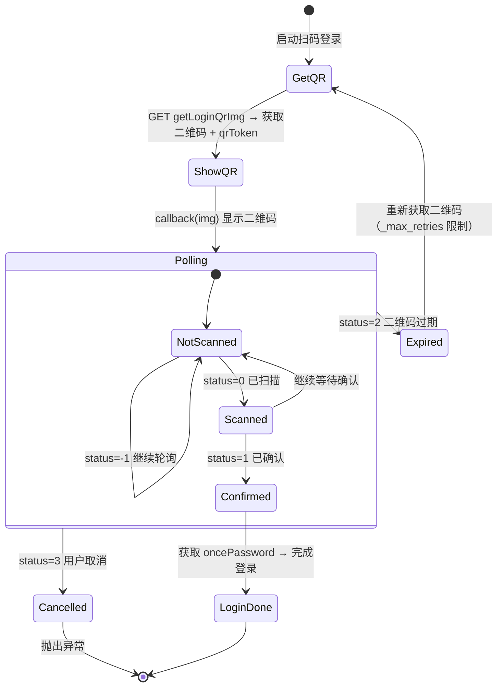

**设计要点**：
- **仅扫码登录**：已删除账号密码登录
- `login_with_qr` 增加 `_max_retries` 参数防止二维码过期时无限递归
- `gologin` 返回 HTML 不解析 JSON
- Cookie 恢复由 CLI 的 `_try_restore_cookies` 处理，通过调用 `ZhidaoCourseManager.get_course_list()` 验证有效性

### 2.6 cache/ — 统一缓存子包

统一管理知到作业与 AI 作业/考试的答案缓存，消除各模块自行实现 JSON 读写的重复代码。

#### 2.6.1 base.py — BaseQuestionCache 抽象基类

```python
from abc import ABC, abstractmethod
from pathlib import Path

class BaseQuestionCache[T](ABC):
    """题目缓存基类（PEP 695 泛型）

    子类通过设置 course_type 与实现序列化方法，复用路径管理与持久化逻辑。
    """

    course_type: str = ""

    def __init__(self, cache_dir: Path | None = None) -> None: ...

    def _cache_path(self, course_id: int | str, exam_id: int | str) -> Path:
        """缓存文件路径: {cache_dir}/{course_type}/{course_id}/{exam_id}.json"""

    def _load_exam(self, course_id: int | str, exam_id: int | str) -> dict[str, T]:
        """加载某个 exam 的缓存（惰性加载，结果缓存在 _loaded）"""

    def _save_exam(self, course_id: int | str, exam_id: int | str, entries: dict[str, T]) -> None:
        """保存某个 exam 的缓存"""

    def _load_all_exams(self, course_id: int | str) -> dict[str, T]:
        """加载课程下所有 exam 的缓存（扫描目录合并）"""

    @abstractmethod
    def _deserialize_entry(self, data: dict[str, Any]) -> T: ...
    @abstractmethod
    def _serialize_entry(self, entry: T) -> dict[str, Any]: ...
```

**设计要点**：
- 使用 PEP 695 类型参数语法 `class BaseQuestionCache[T](ABC):`（替代 `Generic[T]`，ruff UP046 要求）
- 缓存路径统一格式：`{cache_dir}/{course_type}/{course_id}/{exam_id}.json`
- 惰性加载：`_loaded` 字典缓存已读取的 exam，避免重复 IO
- 损坏文件自动跳过并记录日志（`logger.error`），不抛异常
- `_load_all_exams` 扫描课程目录下所有 `.json` 文件并合并，用于构建跨 exam 的合并缓存

#### 2.6.2 zhidao_cache.py — ZhidaoHomeworkCache

```python
class ZhidaoHomeworkCache(BaseQuestionCache[HomeworkCacheEntry]):
    """知到作业答案本地缓存"""

    course_type = "zhidao"

    def get(self, course_id: int, exam_id: str, question_key: str) -> HomeworkCacheEntry | None: ...
    def put(self, course_id: int, exam_id: str, question_key: str, entry: HomeworkCacheEntry) -> None: ...
    def mark_correct(self, course_id: int, exam_id: str, question_key: str, option_ids: list[int]) -> None: ...
    def mark_wrong(self, course_id: int, exam_id: str, question_key: str, option_ids: list[int]) -> None: ...
    def get_correct_options(self, course_id: int, exam_id: str, question_key: str) -> list[int]: ...
    def get_wrong_options(self, course_id: int, exam_id: str, question_key: str) -> list[int]: ...
    def save_ai_analysis(self, course_id: int, exam_id: str, question_key: str, ai_analysis: str) -> None: ...
    def save_options(self, course_id: int, exam_id: str, question_key: str, question_type: int, options: list[HomeworkCacheOption]) -> None: ...
    def find_key_by_options(self, course_id: int, exam_id: str, option_ids: list[int]) -> str | None: ...
    def load_all_for_course(self, course_id: int) -> dict[str, HomeworkCacheEntry]: ...
```

**与旧 HomeworkCache 的差异**：
- 路径从 `zhidao_homework_cache/{courseId}/{examId}.json` 改为 `zhidao/{course_id}/{exam_id}.json`
- key 从 `courseId:examId:questionKey` 改为纯 `question_key`
- 继承 `BaseQuestionCache[HomeworkCacheEntry]`，复用路径与持久化逻辑

#### 2.6.3 ai_cache.py — AiExamCache

```python
class AiExamCache(BaseQuestionCache[dict[str, Any]]):
    """AI 作业/考试缓存（HomeworkCtx 与 ExamCtx 共用）"""

    course_type = "ai"

    def get(self, course_id: int | str, exam_id: int | str, question_id: int) -> dict[str, Any] | None: ...
    def put(self, course_id: int | str, exam_id: int | str, question_id: int, entry: dict[str, Any]) -> None: ...
    def load_all_for_course(self, course_id: int | str) -> dict[str, dict[str, Any]]: ...

    @staticmethod
    def parse_answer(answer_str: str) -> list[str] | None:
        """解析 answer 字段：含 #@# → 分隔，否则单元素列表"""
```

**设计要点**：
- 条目格式：`{"question": str, "answer": str, "answer_content": str, "questionDict": dict}`
- key 为 `question_id` 的字符串形式
- `parse_answer` 静态方法供 `AiExamBase._parse_cached_answer` 委托调用
- `load_all_for_course` 用于构建 `_all_answer_cache`（跨 exam 合并缓存）

#### 2.6.4 zhidao/homework/cache.py — 兼容入口

```python
"""知到作业本地缓存管理（兼容入口）

实际实现已迁移至 zhs.cache.zhidao_cache.ZhidaoHomeworkCache。
本模块通过 PEP 562 懒加载保留 HomeworkCache 别名，避免循环导入。
"""

def __getattr__(name: str) -> object:
    """懒加载 HomeworkCache，避免循环导入"""
    if name == "HomeworkCache":
        from zhs.cache.zhidao_cache import ZhidaoHomeworkCache
        return ZhidaoHomeworkCache
    raise AttributeError(...)

__all__ = ["HomeworkCache"]  # noqa: F822
```

**循环导入解决方案**：
- `zhs.cache.zhidao_cache` → `zhs.zhidao.homework.models` → `zhs.zhidao.homework.__init__` → `analyzer` / `worker`
- `analyzer.py` / `worker.py` 使用 `TYPE_CHECKING` 守卫导入 `HomeworkCache`（仅类型注解，运行时不需要）
- `cache.py` 使用 PEP 562 `__getattr__` 懒加载，打破 `cache → zhidao_cache → cache` 循环

### 2.7 zhidao/ — 知到共享课程

#### 2.7.1 models.py

```python
class CourseInfo(BaseModel):
    """课程基本信息"""
    course_id: int
    name: str

class ZhidaoCourse(BaseModel):
    """知到课程"""
    secret: str               # recruitAndCourseId（alias）
    course_name: str
    course_info: CourseInfo | None = None
    recruit_id: int | None = None

class VideoChapter(BaseModel):
    """章节"""
    id: int
    name: str
    video_lessons: list[VideoLesson] = []

class VideoLesson(BaseModel):
    """课时"""
    id: int
    name: str
    lesson_id: int = 0
    video_id: int = 0
    chapter_id: int = 0
    video_small_lessons: list[VideoSmallLesson] = []
    watch_state: int = 0
    study_total_time: int = 0

class VideoSmallLesson(BaseModel):
    """子视频"""
    video_id: int
    id: int = 0
    name: str = ""
    lesson_id: int = 0
    chapter_id: int = 0
    video_sec: int = 0
    watch_state: int = 0
    study_total_time: int = 0

class QuestionPoint(BaseModel):
    """弹窗题目时间点"""
    time_sec: int
    question_ids: list[int]

class PopupQuestion(BaseModel):
    """弹窗题目详情"""
    question_id: int
    question_options: list[QuestionOption]

class QuestionOption(BaseModel):
    """题目选项"""
    id: int
    content: str = ""
    result: str = ""          # '1' 为正确答案

class ZhidaoContext(BaseModel):
    """知到课程上下文（缓存）"""
    course: ZhidaoCourse
    chapters: VideoChapterList
    videos: dict[int, VideoSmallLesson]
    fucked_time: int = 0
```

**设计要点**：
- pydantic 模型构造时需使用 alias 名称（如 `recruitAndCourseId` 而非 `secret`）以通过 mypy 检查
- mypy 启用 pydantic 插件
- **已删除** `CourseInfo.en_name`（未使用字段）

#### 2.7.2 course.py

```python
class ZhidaoCourseManager:
    """知到课程管理"""

    def __init__(self, session: ZhsSession) -> None: ...
    def get_course_list(self) -> list[ZhidaoCourse]: ...
    def get_context(self, rac_id: str, force: bool = False) -> ZhidaoContext: ...
    def gologin(self, rac_id: str) -> None: ...
    def query_course(self, rac_id: str) -> CourseInfo: ...
    def video_list(self, rac_id: str) -> VideoChapterList: ...
    def query_study_info(self, lesson_ids: list, video_ids: list, recruit_id: int) -> dict: ...
```

#### 2.7.3 video.py

```python
class ZhidaoVideoPlayer:
    """知到视频播放器"""

    def __init__(
        self,
        session: ZhsSession,
        speed: float | None = None,
        end_threshold: float = 0.91,
        time_limit: int = 0,           # 分钟
        progressbar_view: bool = True,
    ) -> None: ...

    def play_course(self, rac_id: str, ctx: ZhidaoContext) -> None: ...
    def play_video(self, rac_id: str, video_id: int) -> None: ...

    # 内部方法
    def _main_loop(self, ctx: ZhidaoContext, video: VideoSmallLesson, ...) -> None: ...
    def _watch_video(self, video_id: int) -> None: ...
    def _report_progress_v2(self, ...) -> None: ...
```

**线程安全设计**（`_watch_video`）：

| 风险 | 解决方案 |
|------|----------|
| Cookie 容器非线程安全 | `_watch_video` 使用独立的 `httpx.Client`，不共享 session 的 cookies |
| Headers 与动态参数覆盖 | 子线程仅复制静态 headers（User-Agent），不修改主 session 的任何状态 |
| 异常捕获盲区 | 子线程内部 `try/except Exception` 全捕获 + `loguru.error` 记录 |
| 线程泄漏 | `daemon=True` + `timeout=30` 超时控制，主循环不 `join()` 等待 |

**视频播放主循环流程**：

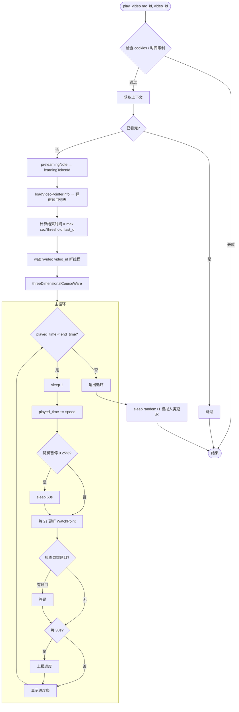

#### 2.7.4 quiz.py

```python
class ZhidaoQuizzer:
    """知到弹窗答题器"""

    def __init__(self, session: ZhsSession) -> None: ...
    def answer_question(self, question: PopupQuestion) -> str: ...
    def load_video_pointer_info(self, rac_id: str, video_id: int) -> list[QuestionPoint]: ...
    def get_popup_exam(self, rac_id: str, video_id: int, question_ids: list[int]) -> PopupQuestion: ...
    def save_answer(self, rac_id: str, video_id: int, question_id: int, answer: str) -> None: ...
```

#### 2.7.5 zhidao/homework/ — 知到作业子包

##### models.py

```python
class HomeworkQuestionType(IntEnum):
    """作业题目类型"""
    SINGLE = 1     # 单选
    MULTI = 2      # 多选
    FILL = 3       # 填空
    JUDGE = 14     # 判断

class HomeworkQuestionOption(BaseModel):
    """作业题目选项"""
    id: str
    content: str = ""

class HomeworkQuestion(BaseModel):
    """作业题目"""
    id: int                       # 数字型 ID
    eid: str                      # 字符串型 ID
    content: str
    question_type: HomeworkQuestionType
    options: list[HomeworkQuestionOption] = []

class HomeworkItem(BaseModel):
    """作业项（扫描结果）"""
    id: str                       # stuExamId
    exam_id: str
    state: int                    # 1=未做, 4=已提交
    course_id: int
    course_name: str
    exam_name: str
    total_score: str
    score: str = "0"
    back_num: int = 0             # 总重做次数
    is_marking: int = 0           # 已重做次数

    @property
    def remaining_redo(self) -> int:
        """剩余重做次数"""

class HomeworkDetail(BaseModel):
    """作业详情（doHomework/lookHomework 返回）"""
    ...

class HomeworkAnswerInfo(BaseModel):
    """答案信息（getStuAnswerInfo 返回）"""
    ...

class HomeworkCacheEntry(BaseModel):
    """缓存条目"""
    ...

class HomeworkExamBase(BaseModel):
    """作业考试基础信息"""
    ...

class HomeworkExamPart(BaseModel):
    """作业考试部分"""
    ...
```

##### scanner.py

```python
class HomeworkScanner:
    """知到作业扫描器"""

    def __init__(self, session: ZhsSession, config: AppConfig) -> None: ...
    def scan_homework(self, recruit_id: str, course_id: int) -> list[HomeworkItem]: ...
    def filter_pending(self, items: list[HomeworkItem]) -> list[HomeworkItem]: ...
```

**扫描逻辑**：
- 调用 `getStudentHomework` 获取作业列表
- 分页扫描（`page_size` 从 `HomeworkConfig` 获取）
- `filter_pending` 过滤待处理作业（state != 4 或得分率 < threshold）

##### worker.py

```python
class HomeworkWorker:
    """知到作业做题器"""

    def __init__(
        self,
        session: ZhsSession,
        config: AppConfig,
        cache: ZhidaoHomeworkCache,
        llm: LLMProvider | None = None,
    ) -> None: ...

    def run_homework(self, item: HomeworkItem, recruit_id: str, school_id: str) -> float:
        """运行完整作业流程，返回最终得分率（0-100）"""
```

**作业做题流程**：

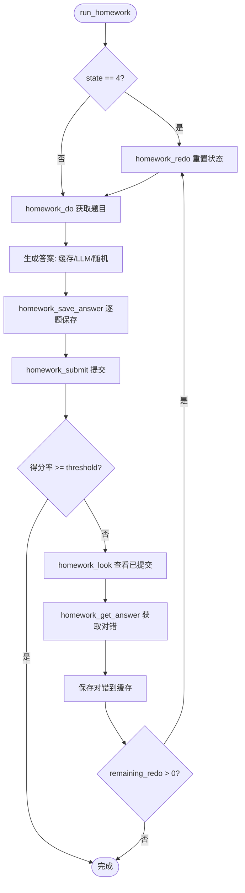

**设计要点**：
- 顺序处理题目（不并发），每题 sleep `delay_min`-`delay_max` 秒，避免 API 限流
- 已提交作业（state=4）需先调用 `homework_redo` 重置状态
- 答案来源优先级：缓存 → LLM → 随机兜底
- 提交后通过 `homework_look` + `homework_get_answer` 获取对错，保存到缓存供下次使用
- 失败时抛出 `ZhsError` 而非原始异常
- 滑块验证触发 `SliderVerificationRequired` 异常

##### analyzer.py

```python
class HomeworkAnalyzer:
    """知到作业错题分析器"""

    def __init__(
        self,
        session: ZhsSession,
        config: AppConfig,
        cache: ZhidaoHomeworkCache,
    ) -> None: ...

    def analyze(self, item: HomeworkItem, recruit_id: str, school_id: str) -> None:
        """分析错题并保存到缓存"""
```

**分析逻辑**：
- 调用 `homework_look` 获取已提交作业详情
- 调用 `homework_get_answer` 获取每题对错信息
- 调用 `ai_analysis_run`（SSE 流式）获取 AI 解析
- 将正确答案保存到 `ZhidaoHomeworkCache` 供下次做题使用

##### cache.py — 兼容入口

> 实际实现已迁移至 [2.6.2 zhidao_cache.py](#262-zhidao_cachepy--zhidaohomeworkcache)。
> 本模块通过 PEP 562 `__getattr__` 懒加载保留 `HomeworkCache` 别名，避免循环导入。
> 新代码应直接使用 `from zhs.cache.zhidao_cache import ZhidaoHomeworkCache`。

### 2.8 hike/ — 职教云课程

#### 2.8.1 models.py

```python
class HikeCourse(BaseModel):
    course_id: int
    course_name: str

class ResourceNode(BaseModel):
    """资源树节点"""
    id: int
    name: str
    data_type: int | None = None     # 3=视频, None=测验, 其他=文件
    study_time: int | None = None
    total_time: int = 0
    child_list: list[ResourceNode] | None = None

class FileInfo(BaseModel):
    file_id: int
    data_id: int
    total_time: int
```

#### 2.8.2 course.py

```python
class HikeCourseManager:
    def __init__(self, session: ZhsSession) -> None: ...
    def get_course_list(self) -> list[HikeCourse]: ...
    def get_context(self, course_id: str) -> ResourceNode: ...
    def query_resource_menu_tree(self, course_id: str) -> list[ResourceNode]: ...
```

#### 2.8.3 video.py

```python
class HikeVideoPlayer:
    def __init__(
        self,
        session: ZhsSession,
        speed: float | None = None,
        end_threshold: float = 0.91,
        time_limit: int = 0,
    ) -> None: ...
    def play_course(self, course_id: str, root: ResourceNode) -> None: ...
    def play_video(self, course_id: str, file_id: str, prev_time: int = 0) -> None: ...
    def play_file(self, course_id: str, file_id: str) -> None: ...
    def _traverse(self, course_id: str, node: ResourceNode, depth: int = 0) -> None: ...
```

**Hike 资源树遍历逻辑**：

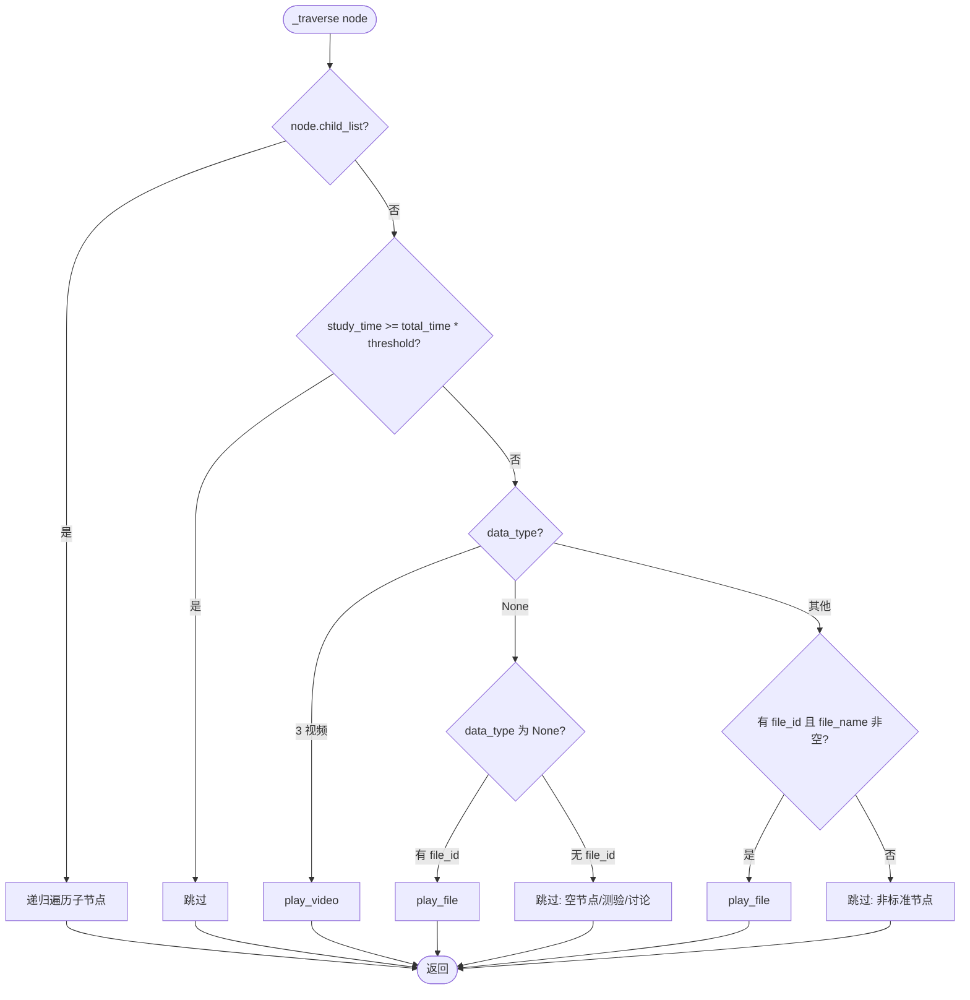

**关键细节**：
- `data_type=3`（视频）→ `play_video`
- `data_type=None` 且有 `file_id` → `play_file`
- `data_type=None` 且无 `file_id` → 跳过（测验、讨论帖等空节点）
- 其他 `data_type` → 检查 `file_id` 和 `file_name`，存在则 `play_file`，否则跳过
- 非标准节点（讨论帖子、微课链接、直播回放、外部跳转链接等）无 `file_id`，自动跳过并记录日志
- `play_file` 内部对 API 返回做 try/except 防护，避免非标准文件导致 KeyError 崩溃

### 2.9 ai/ — AI 课程

#### 2.9.1 models.py

```python
class QuestionType(IntEnum):
    """AI 模块题型枚举（替代魔法数字）"""
    SINGLE = 1     # 单选题
    MULTI = 2      # 多选题
    FILL = 3       # 填空题
    JUDGE = 14     # 判断题

    @classmethod
    def from_int(cls, value: int) -> QuestionType | None:
        """从 int 构造枚举，未知值返回 None"""

class KnowledgePoint(BaseModel):
    knowledge_id: int
    knowledge_name: str
    study_progress: int = 0       # 0-100

class Theme(BaseModel):
    theme_name: str
    knowledge_list: list[KnowledgePoint] = []

class AiCourseInfo(BaseModel):
    course_name: str
    cake_theme_list: list[Theme] = []

class ResourceDetail(BaseModel):
    resources_uid: int
    resources_name: str
    resources_type: int           # 1=视频/PPT, 2=文本/课程视频
    resources_distribute_type: int  # 1=文本, 2=课程视频, 3=视频, 4=PPT
    resources_url: str = ""
    resources_file_id: int = 0

class Resource(BaseModel):
    study_status: int = 0         # 0=未完成, 1=已完成
    resources_detail: ResourceDetail

class ExamInfo(BaseModel):
    exam_test_id: int
    paper_id: int
    mastery_score: int = 0        # alias="masteryScore"

class QuestionSheet(BaseModel):
    question_id: int
    version: int = 1

class QuestionContent(BaseModel):
    id: int
    content: str
    question_type: int            # 1=单选, 2=多选, 3=填空, 14=判断（见 QuestionType）
    option_vos: list[OptionVo] = []
    version: int = 1

class OptionVo(BaseModel):
    id: int
    content: str = ""
    is_correct: int = 0          # 1=正确答案（提交后返回）
```

**设计要点**：
- `QuestionType` IntEnum 替代魔法数字（1/2/3/14），`from_int` 方法对未知值返回 None 而非抛异常
- `ExamInfo.mastery_score` 使用 `alias="masteryScore"`（曾误改为 `highMasteryScore`，已回归修复）
- **已删除** `AnswerCache`（未使用模型）

#### 2.9.2 course.py — AI 课程编排

```python
class AiCourseManager:
    def __init__(self, session: ZhsSession) -> None: ...
    def _ai_query(self, url: str, data: dict, content_type: str = "json") -> dict: ...
    def get_ai_course_list(self) -> list[dict]: ...
    def get_exam_tasks(self, course_id: str) -> list[dict]: ...
    def get_knowledge_points(self, course_id: int, class_id: int) -> AiCourseInfo: ...
    def list_knowledge_resources(self, course_id: int, class_id: int, knowledge_id: int) -> list[Resource]: ...
    def complete_resource(self, course_id: int, class_id: int, knowledge_id: int, resources_uid: int) -> None: ...
    def query_homework(self, course_id: int, class_id: int, knowledge_id: int) -> ExamInfo | None: ...
    def run_course(
        self,
        course_id: int,
        class_id: int,
        ai_config: AIConfig,
        homework_config: HomeworkConfig,
        no_homework: bool = False,
        speed: float = 1.5,
    ) -> None: ...
```

**AI 课程学习流程**：

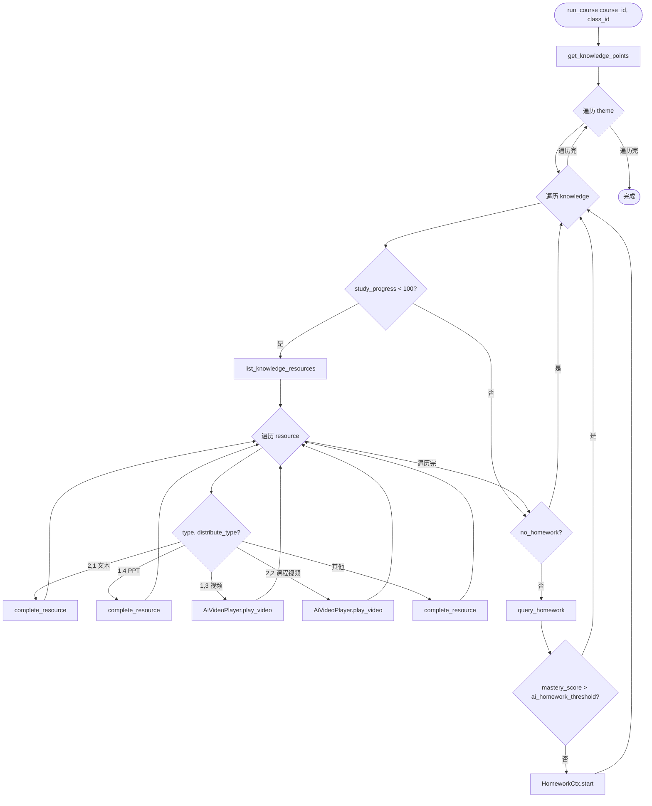

**设计要点**：
- `get_ai_course_list` 使用 `home_key` 加密
- `get_exam_tasks` 使用 `ai_task_query`（`ai_key` 加密）
- `get_knowledge_points` / `list_knowledge_resources` / `complete_resource` 使用 `ai_key` 加密
- 视频播放委托给 `AiVideoPlayer`（从 `AiCourseManager` 中提取）
- 作业委托给 `HomeworkCtx`
- **已删除** 旧的 `ppt_processing` 死分支（PPT 转文本功能不再集成到课程流程）

#### 2.9.3 video.py — AI 视频播放器

```python
class AiVideoPlayer:
    """AI 视频播放器"""

    def __init__(self, session: ZhsSession, speed: float = 1.5) -> None: ...

    def _ai_query(self, url: str, data: dict, content_type: str = "json") -> dict: ...
    def play_video(
        self,
        course_id: int,
        class_id: int,
        file_id: int,
        knowledge_id: int,
        start_at: int = 0,
        speed: float | None = None,
    ) -> None: ...
    def _watch_video(self, file_id: int) -> None: ...
    def _report_video_progress(self, ...) -> None: ...
```

**设计要点**：
- `_ai_query` 使用 `zhidao_query` + `ai_key` 加密
- `play_video` 使用 `speed*2` 步进，2 秒间隔上报进度
- `_watch_video` 使用独立 `httpx.Client` + daemon 线程请求视频流（反检测）
- 从 `AiCourseManager` 中提取，降低 `course.py` 复杂度

#### 2.9.4 exam_base.py — AiExamBase 基类（模板方法模式）

封装 `HomeworkCtx` 与 `ExamCtx` 的公共流程与状态，消除约 500 行重复代码。

```python
class AiExamBase(ABC):
    """AI 作业/考试基类（模板方法模式）

    子类 HomeworkCtx（逐题保存）与 ExamCtx（批量保存）共享此基类。
    """

    def __init__(
        self,
        session: ZhsSession,
        course_id: int | str,
        exam_test_id: int | str,
        exam_paper_id: int | str,
        ai_config: AIConfig,
        op_extra: dict[str, Any] | None = None,
        progress_view: bool = True,
        reporter: ProgressReporter | None = None,
        cache: AiExamCache | None = None,
    ) -> None: ...

    # --- 模板方法 ---
    def start(
        self,
        reference_materials: list[dict[str, str]] | None = None,
        submit: bool = False,
    ) -> tuple[bool, int, int]:
        """执行完整流程：加载缓存 → 打开 → 心跳 → 答题 → 提交 → 结果检查"""

    # --- 抽象方法（子类实现） ---
    @property
    @abstractmethod
    def _exam_base_url(self) -> str: ...
    @abstractmethod
    def _api_query(self, url: str, data: dict[str, Any], method: str = "POST") -> dict[str, Any]: ...
    @abstractmethod
    def _open(self) -> None: ...
    @abstractmethod
    def _get_sheet_content(self) -> list[QuestionSheet]: ...
    @abstractmethod
    def _get_question_content(self, question_id: int, version: int) -> QuestionContent | None: ...
    @abstractmethod
    def _save_answer(self, question_id: int, answers: list[str]) -> bool: ...
    @abstractmethod
    def _submit(self, submit: bool) -> None: ...
    @abstractmethod
    def _answer_questions(self, sheets: list[QuestionSheet]) -> None: ...

    # --- 公共实现 ---
    def _get_cached_answer(self, question_id: int) -> list[str] | None: ...
    @staticmethod
    def _parse_cached_answer(answer_str: str) -> list[str] | None: ...
    def _load_cache(self) -> None: ...
    def _save_cache(self) -> None: ...
    def _heartbeat(self) -> None: ...
```

**设计要点**：
- **模板方法模式**：`start()` 定义算法骨架（加载缓存 → 打开 → 心跳 → 答题 → 提交），子类实现差异化步骤
- **两级缓存**：`_answer_cache`（当前 exam）+ `_all_answer_cache`（跨 exam 合并），持久化通过 `AiExamCache`
- **三级答案策略**：缓存 → AI（LLM）→ 随机兜底
- **LLM 提供者初始化**：通过 `LLMProviderFactory.create()` 统一创建，消除子类重复代码
- **心跳**：`threading.Thread(daemon=True)`，通过 `_stopped` 标志退出
- **缓存委托**：`_load_cache` / `_save_cache` 通过 `self._cache`（`AiExamCache`）读写新格式缓存

#### 2.9.5 homework.py — AI 作业（继承 AiExamBase）

```python
class HomeworkCtx(AiExamBase):
    """AI 作业上下文（逐题保存）

    AI 课程的"考试"实际上是作业，统一命名为 homework。
    """

    def __init__(
        self,
        session: ZhsSession,
        course_id: int,
        knowledge_id: int,
        exam_test_id: int,
        exam_paper_id: int,
        ai_config: AIConfig,
        op_extra: dict[str, Any] | None = None,
        progress_view: bool = True,
    ) -> None: ...

    # 实现抽象方法
    def _open(self) -> None: ...           # openExam（含 examPaperId）
    def _get_sheet_content(self) -> list[QuestionSheet]: ...  # getExamSheetInfo partSheetVos[0]
    def _save_answer(self, question_id: int, answers: list[str]) -> bool: ...  # 逐题 saveAnswer
    def _submit(self, submit: bool) -> None: ...  # submit（含 courseType=8, aiKnlowledgeId）
    def _answer_questions(self, sheets: list[QuestionSheet]) -> None: ...  # 逐题处理
```

**同步实现说明**：
- **顺序处理题目**（不再并发），避免作业 API 限流
- 心跳使用 `threading.Thread(daemon=True)`，通过 `_stopped` 标志退出
- 延迟使用 `time.sleep()`
- LLM 提供者由基类通过 `LLMProviderFactory` 统一初始化

**作业流程**：

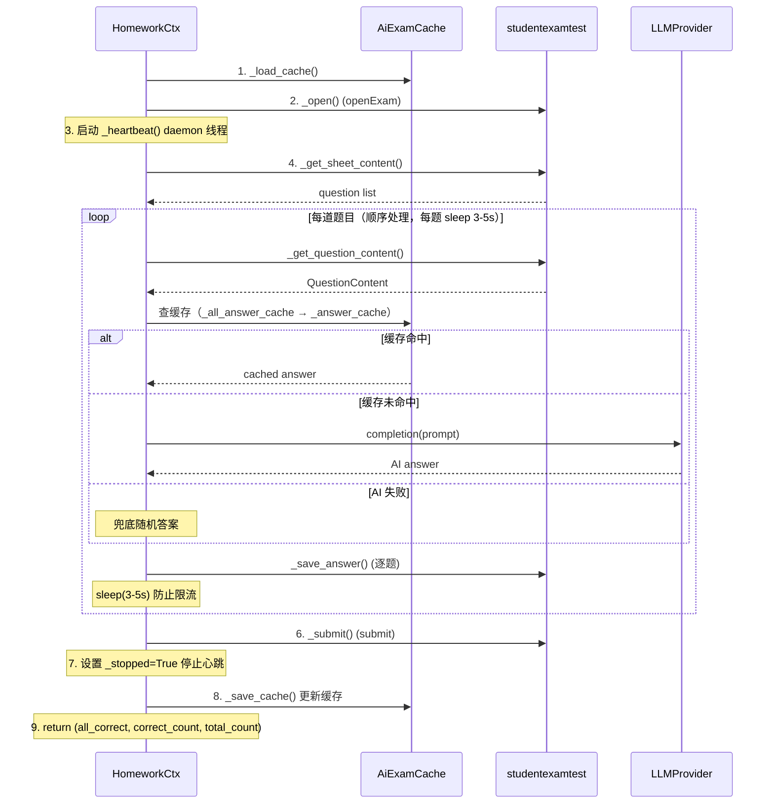

#### 2.9.6 exam.py — AI 考试（继承 AiExamBase）

```python
class ExamCtx(AiExamBase):
    """AI 考试上下文（批量保存）

    与 HomeworkCtx 的区别：
    - taskList 使用 ai_key 加密（ai_task_query）
    - openExam / getAnswerSheetInformation / getExamQuestionInfo / saveBatchAnswer /
      updateUserUsedTime / submit 使用 exam_key（ai_exam_query / ai_exam_submit）
    - openExamDetail 使用 ai_key（ai_task_query），用于提交后判断是否可查看答案
    - 批量保存 saveBatchAnswer（每 save_nums 题保存一次）
    - 填空题 answer 用 / 分隔
    - submit 后若可查看答案（isLookAnswer/isAllowShowDetail=1）则保存正确答案到缓存
    """

    def __init__(
        self,
        session: ZhsSession,
        course_id: str,
        class_id: str,
        exam_test_id: str,
        exam_paper_id: str,
        ai_config: AIConfig,
        exam_config: ExamConfig,
        op_extra: dict[str, Any] | None = None,
        progress_view: bool = True,
        student_id: int = 0,
        task_id: str = "",
    ) -> None: ...

    # 实现抽象方法
    def _open(self) -> None: ...           # openExam
    def _get_sheet_content(self) -> list[QuestionSheet]: ...  # getAnswerSheetInformation
    def _save_answer(self, question_id: int, answers: list[str]) -> bool: ...
    def _submit(self, submit: bool) -> None: ...  # submit
    def _answer_questions(self, sheets: list[QuestionSheet]) -> None: ...  # 批量处理
    def _open_exam_detail(self) -> dict: ...  # 提交后判断是否可查看答案
```

**与 HomeworkCtx 的关键差异**：

| 特性 | HomeworkCtx | ExamCtx |
|------|-------------|---------|
| 加密密钥 | `exam_key` | `exam_key`（考试 API）+ `ai_key`（taskList/openExamDetail） |
| 保存方式 | 逐题 `saveStudentAnswer` | 批量 `saveBatchAnswer`（每 `save_nums` 题） |
| 填空题答案分隔 | 换行 | `/` 分隔 |
| 心跳 API | `updateUserUsedTime` | `updateUserUsedTime` |
| 提交后行为 | 检查得分率 | `openExamDetail` 判断是否可查看答案 |
| 配置 | `HomeworkConfig` | `ExamConfig`（`save_nums`/`delay_min`/`delay_max`） |
| CLI 命令 | `zhs homework` | `zhs exam` |

#### 2.9.7 ppt.py — PPT 转文本

```python
class PptConverter:
    """PPT 转文本（MoonShot API）"""

    def __init__(
        self,
        api_key: str,
        base_url: str = "https://api.moonshot.cn/v1",
        max_file_size_mb: int = 100,
        max_cache_files: int = 500,
        max_cache_size_gb: int = 8,
        delete_after_convert: bool = True,
        cleanup_local: bool = True,
    ) -> None: ...

    def convert(self, url: str) -> str: ...

    # 内部方法
    def _download(self, url: str) -> Path: ...
    def _upload(self, file_path: Path) -> str: ...
    def _extract(self, file_id: str) -> str: ...
    def _delete_remote(self, file_id: str) -> None: ...
    def _cleanup_local(self, file_path: Path) -> None: ...
    def _manage_cache(self) -> None: ...
```

**设计要点**：
- `convert` 流程：`_download` → `_upload` → `_extract` → `_delete_remote`（若 `delete_after_convert`）→ `_cleanup_local`（若 `cleanup_local`）
- `cleanup_local=True`（默认）：转换完成后自动删除本地临时文件，防止大文件课程占满磁盘
- 属性 `_should_cleanup_local` 避免与方法 `_cleanup_local` 冲突
- `_extract` 先尝试 JSON 解析取 `content` 字段，失败则返回原始文本
- `_manage_cache` 按 LRU 策略清理远程缓存

### 2.10 llm/ — LLM 答题模块

#### 2.10.1 base.py

```python
from abc import ABC, abstractmethod

class LLMProvider(ABC):
    """LLM 提供者抽象基类"""

    @abstractmethod
    def completion(self, prompt: str, aim_start: str = "```answer", aim_end: str = "```") -> str: ...

    # 模板方法
    def single_choice(self, question: str, choices: list[dict], reference: list[dict] = []) -> str: ...
    def multiple_choice(self, question: str, choices: list[dict], reference: list[dict] = []) -> str: ...
    def judgement(self, question: str, choices: list[dict], reference: list[dict] = []) -> str: ...
    def fill_blank(self, question: str, reference: list[dict] = []) -> str: ...

    # 答案解析
    def parse_choice_answer(self, completion: str) -> list[int]: ...
    def parse_fill_blank_answer(self, completion: str) -> list[str]: ...
```

#### 2.10.2 factory.py — LLMProviderFactory

```python
class LLMProviderFactory:
    """LLM 提供者工厂

    根据 AIConfig 创建对应的 LLMProvider 实例：
    - AI 禁用 → None
    - use_zhidao_ai=True → ZhidaoAIProvider
    - 有 api_key → OpenAIProvider
    - 其他 → None
    """

    @staticmethod
    def create(
        ai_config: AIConfig,
        session: ZhsSession | None = None,
        course_id: str = "",
        course_name: str = "",
    ) -> LLMProvider | None: ...
```

**设计要点**：
- 统一 LLM 提供者初始化逻辑，消除 `HomeworkCtx`/`ExamCtx` 中的重复代码
- `AiExamBase.__init__` 通过 `LLMProviderFactory.create()` 初始化 `self._provider`
- `ZhidaoAIProvider` 需要 `session` 参数；`OpenAIProvider` 不需要

#### 2.10.3 openai.py

```python
class OpenAIProvider(LLMProvider):
    """OpenAI 兼容接口"""

    def __init__(
        self,
        api_key: str,
        base_url: str = "https://api.openai.com/v1",
        model_name: str = "gpt-4o-mini",
        max_token: int = 27900,
        stream: bool = False,
        extra: dict = {},
    ) -> None: ...

    def completion(self, prompt: str, aim_start: str, aim_end: str) -> str: ...
```

#### 2.10.4 zhidao.py

```python
class ZhidaoAIProvider(LLMProvider):
    """智慧树内置 AI（moonshot-v1-32k）"""

    def __init__(
        self,
        session: ZhsSession,
        course_id: str = "",
        course_name: str = "",
        stream: bool = False,
        extra: dict = {},
    ) -> None: ...

    def completion(self, prompt: str, aim_start: str, aim_end: str) -> str: ...
```

**设计要点**：
- `ZhidaoAIProvider` 使用 `self._session._get_client().post()` 发送请求（`ZhsSession` 无 `post` 方法）
- 内部实现签名逻辑（替代已删除的 `sign_zhidao_ai`）

#### 2.10.5 prompts.py

```python
def build_choice_prompt(
    question: str,
    choices: list[dict],
    answer_type: str,           # "单选题" | "多选题" | "判断题"
    reference_materials: list[dict] = [],
    extra: dict = {},
) -> str: ...

def build_fill_blank_prompt(
    question: str,
    reference_materials: list[dict] = [],
    extra: dict = {},
) -> str: ...
```

**Prompt 模板结构**：

```mermaid
flowchart TD
    subgraph ChoicePrompt[选择题/判断题 Prompt]
        Ref1["[参考资料（如有）]"]
        Ctx1["假设你是一名学生，正在学习《{courseName}》。\n现在，你学习到了{theme}。\n本次考察知识点为{knowledgePoint}。"]
        Instruct1["本题为{answer_type}，请从选项中选择{最合适的答案/所有正确的答案}，\n回答放到 markdown 代码块中"]
        Format1["```answer\n[{id: xxx, content: xxx}]\n```"]
        Q1["{question}"]
        Choices1["```choices\n{choices_json}\n```"]
        Ref1 --> Ctx1 --> Instruct1 --> Format1 --> Q1 --> Choices1
    end

    subgraph FillBlankPrompt[填空题 Prompt]
        Ref2["[参考资料（如有）]"]
        Ctx2["假设你是一名学生..."]
        Instruct2["本题为填空题，请填写空白处内容，\n每空一行，放到 markdown 代码块中"]
        Format2["```answer\n答案1\n答案2\n```"]
        Q2["{question}"]
        Ref2 --> Ctx2 --> Instruct2 --> Format2 --> Q2
    end
```

### 2.11 utils/ — 工具模块

#### 2.11.1 display.py

```python
def progress_bar(
    iteration: int,
    total: int,
    prefix: str = "",
    suffix: str = "",
    length: int | None = None,
    fill: str = "#",
    enabled: bool = True,
) -> None: ...

def show_qrcode_img(img_bytes: bytes) -> None: ...

def tree_print(text: str, depth: int = 0, width_limit: int = 80, prefix: str = "  |", enabled: bool = True) -> None: ...
def wipe_line() -> None: ...

# 消息样式辅助
def msg_done(text: str) -> str: ...
def msg_error(text: str) -> str: ...
def msg_info(text: str) -> str: ...
def msg_warn(text: str) -> str: ...
def msg_skip(text: str) -> str: ...
def course_tag(course_type: str) -> str: ...
def styled(text: str, *styles: str) -> str: ...
```

**设计要点**：
- **已删除** `show_qr_image`（旧版二维码显示，已由 `show_qrcode_img` 替代）
- **已删除** `terminal_qr_unicode` / `terminal_qr_tty`（不再使用终端二维码）
- 新增消息样式辅助函数（`msg_done`/`msg_error`/`msg_info`/`msg_warn`/`msg_skip`/`course_tag`/`styled`）

#### 2.11.2 cookie.py

```python
def cookies_to_list(cookies: httpx.Cookies) -> list[dict]: ...
def list_to_cookies(data: list[dict]) -> httpx.Cookies: ...
```

#### 2.11.3 path.py

```python
def get_data_dir() -> Path:
    """获取数据目录（~/.zhs/ 或项目目录）"""

def get_config_path() -> Path: ...
def get_real_path(path: str) -> Path: ...
```

**设计要点**：
- **已删除** `version_cmp`（未使用的版本比较函数）

### 2.12 logger.py — 日志模块

基于 loguru 的日志系统，替代旧版自定义 MonoLogger。

#### 2.12.1 设计目标

| 目标 | 说明 |
|------|------|
| 零配置可用 | 模块内 `from loguru import logger` 直接使用，无需手动初始化 |
| 一次性配置 | CLI 入口调用 `_setup_logger(config)` 完成所有 sink 注册 |
| 双通道 | stderr（控制台实时）+ 文件（持久化审计） |
| 敏感信息脱敏 | 自动过滤 cookie/token/password 等字段 |
| 文件轮转 | 按日期轮转，保留 30 天，gz 压缩 |
| 线程安全 | loguru 本身线程安全，无需额外同步 |

#### 2.12.2 公开 API

```python
from zhs.config import AppConfig

def setup_logging(config: AppConfig) -> None:
    """
    配置 loguru 日志系统（幂等）。
    - 移除 loguru 默认 sink（id=0）
    - 注册文件 sink（按日期轮转，保留 30 天，gz 压缩）
    - 注册 stderr sink（可选，由 console_log/debug 控制）
    - 注册敏感信息过滤 filter
    """

def get_log_dir() -> Path:
    """返回日志文件目录路径（<data_dir>/logs/），自动创建"""
```

#### 2.12.3 格式定义

**控制台格式**（紧凑、彩色）：

```
INFO    | zhs.login - 登录成功: uuid=Xe6arnRO
DEBUG   | zhs.session - API 请求: url=/login/gologin
WARNING | zhs.video - 视频进度异常: played=0.8 end=1.0
ERROR   | zhs.session - API 请求失败: code=-12
```

格式串：`<level>{level:<7}</level> | <cyan>{name}</cyan> - {message}`

**文件格式**（完整、结构化）：

```
2026-06-13 14:23:01.123 | INFO     | MainThread | zhs.login:login_with_qr:89 | 登录成功: uuid=Xe6arnRO
2026-06-13 14:23:02.456 | DEBUG    | Thread-3   | zhs.zhidao.video:_watch_video:142 | API 请求: url=/login/gologin
```

格式串：`{time:YYYY-MM-DD HH:mm:ss.SSS} | {level:<8} | {thread.name} | {name}:{function}:{line} | {message}`

#### 2.12.4 敏感信息过滤

通过 loguru 的 `filter` 机制（而非 `patcher`，因 loguru 0.7.3 的 `patch()` 返回新实例而非修改全局 logger）实现脱敏：

```python
def _sensitive_filter(record: loguru.Record) -> None:
    """对 record["message"] 中的敏感字段进行脱敏"""
    for pattern in _SENSITIVE_PATTERNS:
        record["message"] = pattern.sub(r'\1=***', record["message"])
```

脱敏规则：

| 模式 | 示例输入 | 脱敏后 |
|------|----------|--------|
| `CASLOGC=<value>` | `CASLOGC=%7B%22uuid%22...%7D` | `CASLOGC=***` |
| `token=<value>` | `token=abc123def` | `token=***` |
| `password=<value>` | `password=mysecret` | `password=***` |
| `apiKey=<value>` | `apiKey=sk-xxxx` | `apiKey=***` |
| `Authorization: Bearer <value>` | `Authorization: Bearer eyJ...` | `Authorization: Bearer ***` |

#### 2.12.5 线程安全考量

| 场景 | loguru 行为 | 结论 |
|------|-------------|------|
| 多线程写日志 | 内部有锁，消息不会交错 | 安全 |
| `_watch_video` daemon 线程 | 线程内 logger 调用正常 | 安全 |
| 运行时修改 sink | `logger.add()`/`logger.remove()` 线程安全 | 安全 |

### 2.13 __main__.py — CLI 入口（命令式）

```python
import typer

app = typer.Typer(name="zhs", help="智慧树自动刷课工具", no_args_is_help=True)

@app.command()
def init() -> None:
    """初始化 .zhs/ 目录及默认配置"""

@app.command()
def login(
    show_in_terminal: bool = typer.Option(False, "--show-in-terminal"),
    image_path: str | None = typer.Option(None, "--image-path"),
    proxy: str | None = typer.Option(None, "--proxy"),
    debug: bool = typer.Option(False, "-d", "--debug"),
    console_log: bool = typer.Option(False, "--console-log"),
) -> None:
    """扫码登录智慧树"""

@app.command()
def play(
    course: list[str] | None = typer.Option(None, "-c", "--course"),
    course_type: str | None = typer.Option(None, "--type"),
    ai_course: int | None = typer.Option(None, "--ai-course"),
    ai_class: int | None = typer.Option(None, "--ai-class"),
    speed: float | None = typer.Option(None, "-s", "--speed"),
    limit: int = typer.Option(0, "-l", "--limit", min=0),
    proxy: str | None = typer.Option(None, "--proxy"),
    debug: bool = typer.Option(False, "-d", "--debug"),
    console_log: bool = typer.Option(False, "--console-log"),
) -> None:
    """刷视频"""

@app.command()
def homework(
    course: list[str] | None = typer.Option(None, "-c", "--course"),
    course_type: str | None = typer.Option(None, "--type"),
    url: str | None = typer.Option(None, "--url"),
    ai_course: int | None = typer.Option(None, "--ai-course"),
    ai_class: int | None = typer.Option(None, "--ai-class"),
    no_ai: bool = typer.Option(False, "--no-ai"),
    homework_threshold: int | None = typer.Option(None, "--homework-threshold"),
    max_submit: int | None = typer.Option(None, "--max-submit"),
    proxy: str | None = typer.Option(None, "--proxy"),
    debug: bool = typer.Option(False, "-d", "--debug"),
    console_log: bool = typer.Option(False, "--console-log"),
) -> None:
    """写作业"""

@app.command()
def exam(
    course: list[str] | None = typer.Option(None, "-c", "--course"),
    course_type: str | None = typer.Option(None, "--type"),
    ai_course: int | None = typer.Option(None, "--ai-course"),
    ai_class: int | None = typer.Option(None, "--ai-class"),
    submit: bool = typer.Option(False, "--submit"),
    proxy: str | None = typer.Option(None, "--proxy"),
    debug: bool = typer.Option(False, "-d", "--debug"),
    console_log: bool = typer.Option(False, "--console-log"),
) -> None:
    """AI 课程考试"""

@app.command()
def fetch(
    fetch_type: str = typer.Option("all", "--type"),
    proxy: str | None = typer.Option(None, "--proxy"),
    debug: bool = typer.Option(False, "-d", "--debug"),
    console_log: bool = typer.Option(False, "--console-log"),
) -> None:
    """获取课程数据"""
```

**CLI 命令一览**：

| 命令 | 用途 | 关键参数 |
|------|------|----------|
| `zhs init` | 初始化配置目录 | 无 |
| `zhs login` | 扫码登录 | `--show-in-terminal`, `--image-path`, `--proxy` |
| `zhs play` | 刷视频 | `-c/--course`, `--type`, `--ai-course`, `--ai-class`, `-s/--speed`, `-l/--limit` |
| `zhs homework` | 写作业 | `-c/--course`, `--type`, `--url`, `--ai-course`, `--ai-class`, `--no-ai`, `--homework-threshold`, `--max-submit` |
| `zhs exam` | AI 课程考试 | `--ai-course`, `--ai-class`, `--type ai`, `--submit` |
| `zhs fetch` | 获取课程数据 | `--type all/course/homework` |

**CLI 执行主流程**：

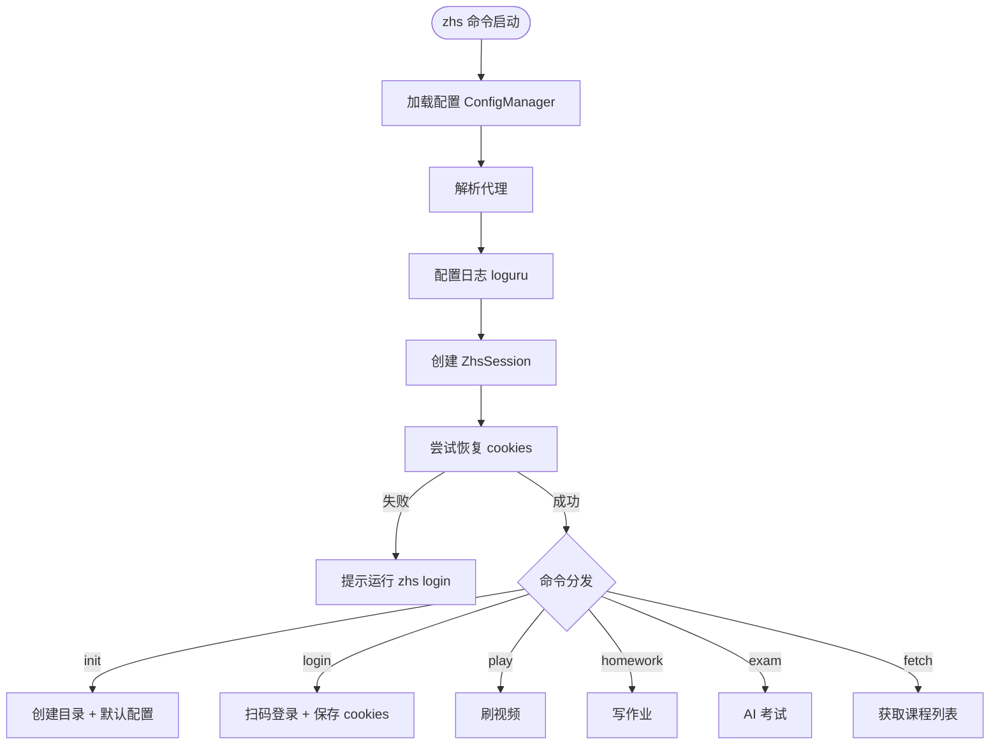

**play 命令路由**：

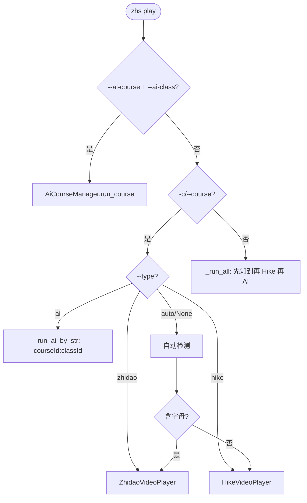

**homework 命令路由**：

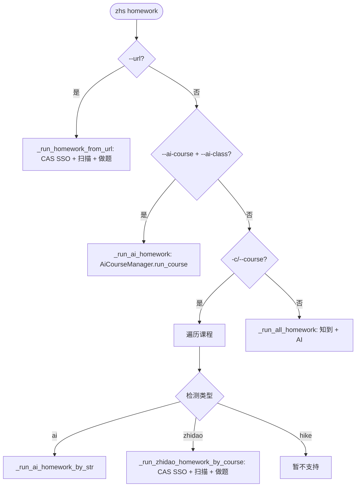

**课程类型检测说明**：
- `--type` 参数优先级最高，显式指定 `zhidao`/`hike`/`ai`/`auto` 时直接路由
- 自动检测（"含字母→知到，纯数字→Hike"）仅作为 fallback
- `--type auto` 等同于不指定，执行全刷模式

**设计要点**：
- 使用 typer 框架替代旧版 argparse
- `B008` 规则使用 `# noqa: B008` 抑制（typer.Option 在函数默认参数中）
- `no_args_is_help=True`：无参数时显示帮助
- AI 课程使用 `--ai-course` + `--ai-class` 显式指定 courseId 和 classId
- 知到作业需先调用 `session.exam_sso_login()` 进行 CAS SSO 认证

---

## 3. 数据流

### 3.1 知到视频刷课数据流

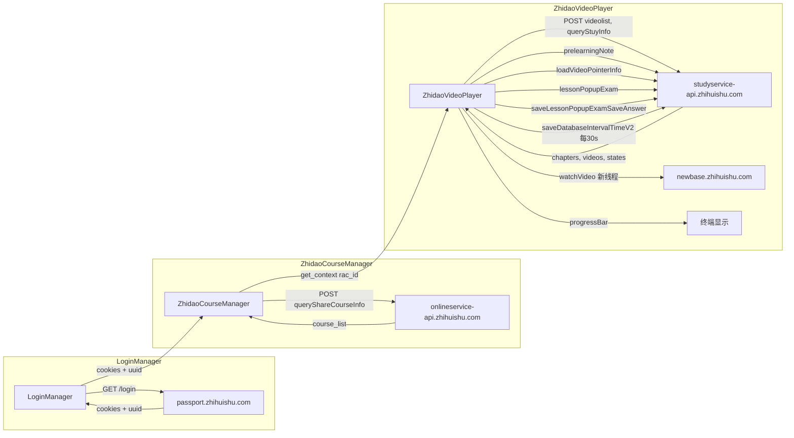

### 3.2 知到作业数据流

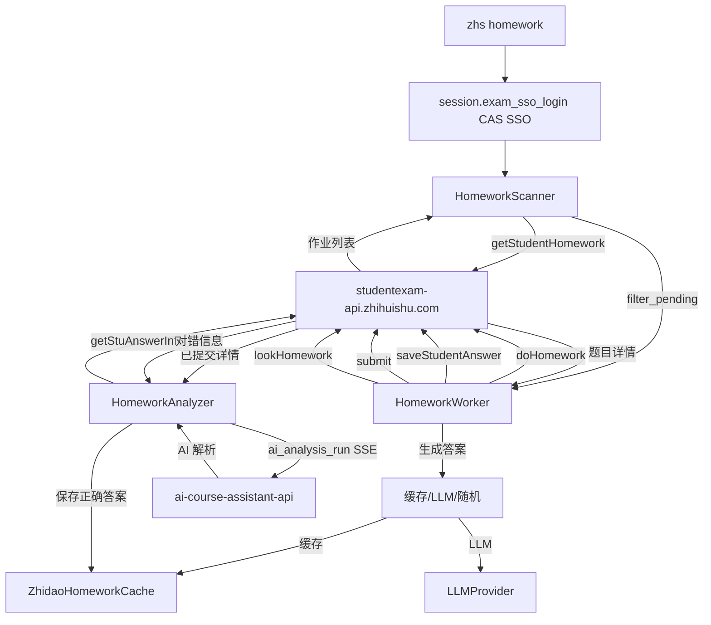

### 3.3 AI 考试数据流

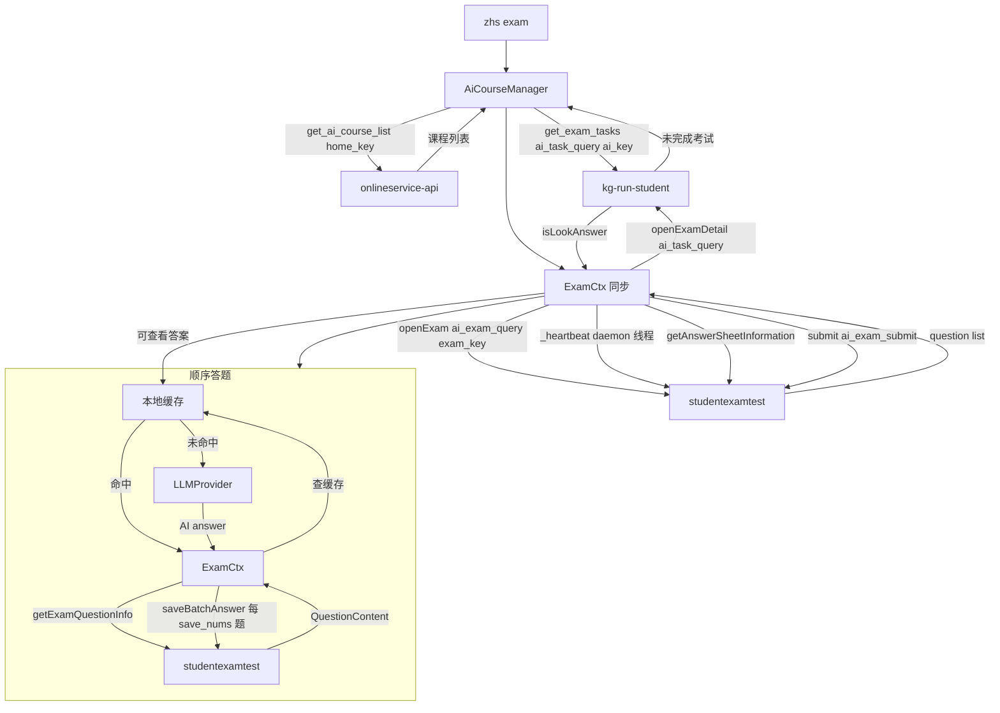

---

## 4. 测试策略

### 4.1 TDD 开发流程

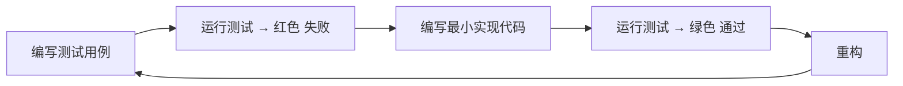

### 4.2 测试分层

| 层级 | 覆盖内容 | Mock 策略 |
|------|----------|-----------|
| **单元测试** | crypto、models、prompts、cookie、path、display | 无外部依赖 |
| **集成测试** | session API 查询、login 流程、homework 流程 | Mock httpx 响应（respx） |
| **端到端测试** | 完整刷课流程、CLI 命令 | Mock 全部 API |

### 4.3 关键测试用例

**crypto.py**：
- AES 加解密对称性
- ev 编码（无对称解码测试，因 `decode_ev` 已删除）
- Hike 签名与已知结果对比
- WatchPoint 生成逻辑

**session.py**：
- `zhidao_query` 自动加密和时间戳（`dateFormate` 加入 data 加密 + 独立字段）
- `homework_query` 不发送 `dateFormate`
- `ai_exam_query` 发送 `dateFormate`，检查 `code`
- `ai_task_query` 使用 `ai_key`
- `hike_query` 自动签名
- Cookie 解析 uuid
- API 错误码映射异常

**config.py**：
- TOML 加载/保存
- 旧版 JSON 配置迁移
- 默认值填充
- alias 字段兼容

**zhidao/homework/**：
- `HomeworkScanner` 扫描和过滤
- `HomeworkWorker` 做题流程（doHomework → saveAnswer → submit → look → analyze）
- `HomeworkAnalyzer` 错题分析
- `ZhidaoHomeworkCache` 缓存读写（新路径格式 `zhidao/{course_id}/{exam_id}.json`）
- 滑块验证异常

**cache/**：
- `BaseQuestionCache` 路径管理、惰性加载、损坏文件处理
- `ZhidaoHomeworkCache` 对错标记、AI 解析保存、选项匹配
- `AiExamCache` 答案存取、跨 exam 合并、`parse_answer` 静态方法

**ai/exam_base.py**：
- `AiExamBase` 模板方法流程（start → load_cache → open → heartbeat → answer → submit）
- 两级缓存（`_answer_cache` / `_all_answer_cache`）
- 三级答案策略（缓存 → AI → 随机）

**ai/homework.py**：
- 缓存命中/未命中
- 同步心跳启停（`_stopped` 标志）
- 顺序处理（不并发）

**ai/exam.py**：
- 批量保存（`save_nums`）
- 填空题 `/` 分隔
- `openExamDetail` 判断可查看答案
- 考试重试逻辑

**ai/video.py**：
- `play_video` 进度上报（`speed*2`, 2s 间隔）
- `_watch_video` 独立线程

### 4.4 Mock 示例

```python
# tests/conftest.py
import pytest
import respx
from zhs.config import AppConfig
from zhs.session import ZhsSession

@pytest.fixture
def mock_config() -> AppConfig:
    """用于 Mock session 的配置"""
    return AppConfig()

@pytest.fixture
def mock_session(mock_config: AppConfig) -> Generator[ZhsSession, None, None]:
    """带 Mock HTTP 的 session

    ⚠️ 注意：不能在 fixture 上使用 @respx.mock 装饰器！
    因为 @respx.mock 的 Mock 环境仅在 fixture 函数体内生效，
    当 fixture return 后 Mock 立即关闭，下游测试会穿透到真实网络。

    正确做法：在 fixture 内用 respx.mock 上下文管理器 + yield，
    使 Mock 生命周期覆盖整个测试用例执行期。
    """
    with respx.mock:
        session = ZhsSession(mock_config)
        yield session

@pytest.fixture
def authenticated_session(mock_session: ZhsSession) -> ZhsSession:
    """已认证的 session（含 uuid 和 cookies）"""
    mock_session.cookies.set(
        "CASLOGC",
        '{"uuid":"test-uuid-123"}',
        domain="zhihuishu.com",
    )
    return mock_session
```

---

## 5. 开发顺序

按依赖关系从底层到上层：

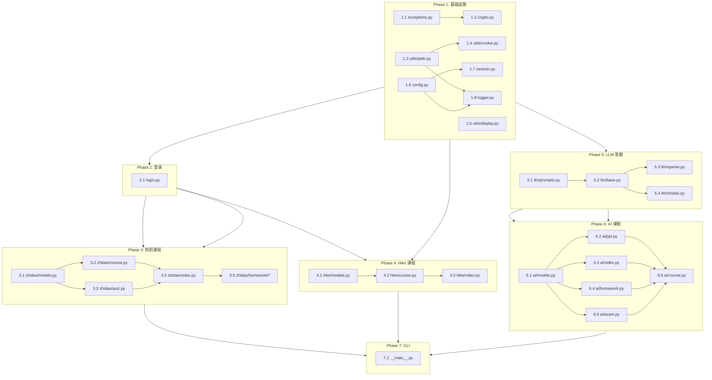

每个 Phase 内的模块可并行开发，Phase 间有依赖需顺序完成。

---

## 6. 设计约束

1. **密钥不硬编码**：所有密钥从 `CryptoConfig` 获取，构造时显式传入
2. **URL 不硬编码**：所有 URL 从 `UrlConfig` 获取
3. **异常链**：`raise ZhsError(...) from e`，禁止裸 `raise ZhsError`
4. **线程安全**：`_watch_video` 使用独立 `httpx.Client`，daemon=True，全捕获 Exception
5. **同步延迟**：所有代码均为同步，使用 `time.sleep()`，禁止 `asyncio.sleep()`
6. **顺序处理**：`HomeworkCtx` 顺序处理题目（不再并发），每题 sleep 3-5s，避免 API 限流
7. **心跳线程**：`AiExamBase._heartbeat` 使用 `threading.Thread(daemon=True)`，通过 `_stopped` 标志退出
8. **本地文件清理**：`PptConverter` 默认 `cleanup_local=True`
9. **课程类型**：CLI `--type` 支持 `zhidao/hike/ai/auto` 显式覆盖自动检测
10. **Hike 资源树**：无 `file_id` 的非标准节点跳过 + 日志，`play_file` 内 try/except 防护 KeyError
11. **测试 Mock**：`mock_session` fixture 用 `with respx.mock: yield`，禁止 `@respx.mock` 装饰器
12. **AI 作业命名**：AI 课程的"考试"统一称为"作业"（homework），代码中使用 `HomeworkCtx`（非 ExamCtx），文件名 `ai/homework.py`（非 `ai/exam.py`）
13. **CLI 命令式**：使用 `zhs play/homework/exam/fetch` 命令式接口，禁止旧的 `zhs -c ID` 风格
14. **作业 API 加密**：知到作业 API（`studentexam-api`）使用 `exam_key` 加密，**不发送 `dateFormate`** 字段，与知到视频 API（`studyservice-api`）不同
15. **AI 考试 API 加密**：AI 考试 API（`studentexamtest`）使用 `exam_key` 加密，**发送 `dateFormate`** 字段，检查 `code` 字段（与知到作业 API 不同）
16. **禁止 asyncio**：项目不再使用 `asyncio`，所有代码同步实现；`session.py` 无 `_async_client`/`async_api_query`/`aclose` 等异步接口
17. **统一缓存路径**：所有缓存路径格式为 `~/.zhs/cache/{course_type}/{course_id}/{exam_id}.json`，通过 `BaseQuestionCache` 子类实现
18. **PEP 695 泛型**：泛型类使用 `class Foo[T](ABC):` 语法（非 `Generic[T]`），ruff UP046 要求
19. **循环导入**：`zhidao/homework/cache.py` 使用 PEP 562 `__getattr__` 懒加载；`analyzer.py`/`worker.py` 使用 `TYPE_CHECKING` 守卫仅用于类型注解的导入
20. **模板方法模式**：`HomeworkCtx` 与 `ExamCtx` 必须继承 `AiExamBase`，公共流程在基类实现，差异通过抽象方法委托
