# ZHS 详细设计文档

> 本文档基于 [spec.md](./spec.md) 的功能规格和技术栈决策，给出模块级详细设计。

---

## 1. 项目结构

```
e:\project\python\ZHS\
├── pyproject.toml              # 项目配置
├── README.md
├── src/
│   └── zhs/
│       ├── __init__.py         # 版本号导出
│       ├── __main__.py         # CLI 入口（typer app）
│       ├── config.py           # 配置管理（TOML）
│       ├── crypto.py           # 加解密（AES / ev / 签名）
│       ├── session.py          # HTTP 会话管理（httpx）
│       ├── login.py            # 登录（扫码）
│       ├── exceptions.py       # 全局异常定义
│       ├── zhidao/             # 知到共享课程
│       │   ├── __init__.py
│       │   ├── models.py       # 数据模型
│       │   ├── course.py       # 课程列表与上下文
│       │   ├── video.py        # 视频刷课
│       │   └── quiz.py         # 弹窗答题
│       ├── hike/               # 职教云课程
│       │   ├── __init__.py
│       │   ├── models.py       # 数据模型
│       │   ├── course.py       # 课程列表与上下文
│       │   └── video.py        # 视频刷课
│       ├── ai/                 # AI 课程
│       │   ├── __init__.py
│       │   ├── models.py       # 数据模型
│       │   ├── course.py       # AI 课程学习
│       │   ├── exam.py         # AI 考试（异步）
│       │   └── ppt.py          # PPT 转文本
│       ├── llm/                # LLM 答题
│       │   ├── __init__.py
│       │   ├── base.py         # 抽象基类
│       │   ├── openai.py       # OpenAI 兼容接口
│       │   ├── zhidao.py       # 智慧树内置 AI
│       │   └── prompts.py      # Prompt 模板
│       └── utils/              # 工具
│           ├── __init__.py
│           ├── display.py      # 进度条 / 二维码 / 树形视图
│           ├── cookie.py       # Cookie 序列化
│           └── path.py         # 路径工具
├── tests/                      # 测试目录（镜像 src/zhs 结构）
│   ├── conftest.py             # 全局 fixtures
│   ├── test_crypto.py
│   ├── test_config.py
│   ├── test_session.py
│   ├── test_login.py
│   ├── zhidao/
│   │   ├── test_course.py
│   │   ├── test_video.py
│   │   └── test_quiz.py
│   ├── hike/
│   │   ├── test_course.py
│   │   └── test_video.py
│   ├── ai/
│   │   ├── test_course.py
│   │   ├── test_exam.py
│   │   └── test_ppt.py
│   └── llm/
│       ├── test_openai.py
│       ├── test_zhidao.py
│       └── test_prompts.py
└── docs/
    ├── spec.md
    └── design.md              # 本文档
```

使用 `src` layout，通过 `pip install -e .` 安装后 `zhs` 命令可用。

---

## 2. 核心模块设计

### 2.1 exceptions.py — 全局异常

```python
class ZhsError(Exception):
    """ZHS 基础异常"""

class TimeLimitExceeded(ZhsError):
    """刷课时间超过限制"""

class CaptchaRequired(ZhsError):
    """服务端要求验证码（API 返回 code -12）"""

class LoginFailed(ZhsError):
    """登录失败"""

class InvalidCookies(ZhsError):
    """Cookies 无效或过期"""

class ApiError(ZhsError):
    """API 返回错误"""
    def __init__(self, code: int, message: str):
        self.code = code
        self.message = message
        super().__init__(f"API error {code}: {message}")
```

### 2.2 crypto.py — 加解密模块

```python
from Crypto.Cipher import AES
from base64 import b64encode, b64decode
from hashlib import md5
from zhs.config import CryptoConfig

class Cipher:
    """AES-128-CBC 加解密器"""
    def __init__(self, key: bytes, iv: bytes) -> None: ...
    def encrypt(self, plaintext: str) -> str: ...
    def decrypt(self, ciphertext: str) -> str: ...

class WatchPoint:
    """视频观看轨迹点生成器"""
    def __init__(self, init: int = 0) -> None: ...
    def add(self, end: int, start: int | None = None) -> None: ...
    def get(self) -> str: ...
    def reset(self, init: int = 0) -> None: ...

def encode_ev(data: list, key: str = "zzpttjd") -> str:
    """ev 编码（XOR）"""

def decode_ev(ev: str, key: str = "zzpttjd") -> str:
    """ev 解码"""

def sign_hike(params: dict, salt: str) -> str:
    """Hike API 签名（MD5），salt 从 CryptoConfig 获取"""

def sign_zhidao_ai(data: dict, prefix: str) -> tuple[str, dict]:
    """智慧树 AI 对话签名，prefix 从 CryptoConfig 获取，返回 (signed_url, body)"""
```

**设计要点**：
- **密钥不再硬编码**，所有密钥从 `CryptoConfig` 读取，`Cipher` 构造时必须显式传入 `key` 和 `iv`
- `WatchPoint` 维护轨迹点列表，`gen(time) = time // 5 + 2`，初始值为 `[0, 1]`
- `encode_ev` / `decode_ev` 对称实现 XOR 编码，注意 `tmp[-4:]` 截断（与原始代码一致）
- `sign_hike` 按固定字段顺序拼接后 MD5：`SALT + uuid + courseId + fileId + studyTotalTime + startDate + endDate + endWatchTime + startWatchTime + uuid`
- `sign_zhidao_ai` 生成 `sessionNid`（格式 `chatcmpl-` + 24位随机字符）、构建签名、返回带 `sign` 参数的 URL
- 调用方通过 `config.crypto.iv`、`config.crypto.video_key` 等获取密钥，传入 `Cipher`、`sign_hike` 等函数

### 2.3 config.py — 配置管理

```python
from pydantic import BaseModel
from pathlib import Path

class CryptoConfig(BaseModel):
    """加解密密钥配置（可覆盖，默认值与旧版一致）"""
    iv: str = "1g3qqdh4jvbskb9x"
    home_key: str = "7q9oko0vqb3la20r"
    video_key: str = "azp53h0kft7qi78q"
    qa_key: str = "kcGOlISPkYKRksSK"
    ai_key: str = "hw2fdlwcj4cs1mx7"
    exam_key: str = "onbfhdyvz8x7otrp"
    hike_salt: str = "o6xpt3b#Qy$Z"
    zhidao_ai_sign_prefix: str = "8ZflKEagfL"
    ev_key: str = "zzpttjd"

    def key_bytes(self, name: str) -> bytes:
        """将密钥名转为 bytes，如 key_bytes('video_key') → b'azp53h0kft7qi78q'"""

class UrlConfig(BaseModel):
    """API 基础 URL 配置（可覆盖，便于部署私有镜像或 API 变更）"""
    base: str = "https://onlineservice.zhihuishu.com"
    passport: str = "https://passport.zhihuishu.com"
    hike: str = "https://hike.zhihuishu.com"
    ai_exam: str = "https://aiexam.zhihuishu.com"
    ai_chat: str = "https://chat.zhihuishu.com"

class OpenAIConfig(BaseModel):
    api_base: str = "https://api.openai.com"
    api_key: str = ""
    model_name: str = ""

class MoonShotConfig(BaseModel):
    base_url: str = "https://api.moonshot.cn/v1"
    api_key: str = ""
    delete_after_convert: bool = True

class PptProcessingConfig(BaseModel):
    provide_to_ai: bool = False
    moonshot: MoonShotConfig = MoonShotConfig()

class AIConfig(BaseModel):
    enabled: bool = True
    use_zhidao_ai: bool = True
    openai: OpenAIConfig = OpenAIConfig()
    ppt_processing: PptProcessingConfig = PptProcessingConfig()
    use_stream: bool = True

class QrExtraConfig(BaseModel):
    show_in_terminal: bool | None = None
    ensure_unicode: bool = False

class AppConfig(BaseModel):
    save_cookies: bool = True
    proxies: dict[str, str] = {}
    log_level: str = "INFO"
    tree_view: bool = True
    progressbar_view: bool = True
    qr_extra: QrExtraConfig = QrExtraConfig()
    image_path: str = ""
    crypto: CryptoConfig = CryptoConfig()
    urls: UrlConfig = UrlConfig()
    ai: AIConfig = AIConfig()

class ConfigManager:
    """配置管理器：加载/保存/迁移 TOML 配置"""
    def __init__(self, config_path: Path | None = None) -> None: ...
    def load(self) -> AppConfig: ...
    def save(self, config: AppConfig) -> None: ...
    def migrate(self, old: dict) -> AppConfig: ...
```

**设计要点**：
- 配置格式从 JSON 迁移到 TOML，支持注释
- 所有配置项用 pydantic BaseModel 定义，带默认值
- `ConfigManager` 负责加载、保存、旧版迁移
- CLI 参数通过 `AppConfig` 的可选字段覆盖

**TOML 配置文件示例** (`config.toml`):

```toml
# ZHS 配置文件

[auth]
save_cookies = true      # 保存 cookies 以便下次免登录

[network]
proxies = {}             # 例: {http = "http://127.0.0.1:8080"}

[display]
log_level = "INFO"       # DEBUG / INFO / WARNING / ERROR
tree_view = true
progressbar_view = true

[qr]
show_in_terminal = null  # null = Windows 默认终端显示
ensure_unicode = false
image_path = ""          # 二维码保存路径，空则不保存

[crypto]
# 所有密钥均可覆盖，默认值与旧版一致；一般无需修改
iv = "1g3qqdh4jvbskb9x"
home_key = "7q9oko0vqb3la20r"
video_key = "azp53h0kft7qi78q"
qa_key = "kcGOlISPkYKRksSK"
ai_key = "hw2fdlwcj4cs1mx7"
exam_key = "onbfhdyvz8x7otrp"
hike_salt = "o6xpt3b#Qy$Z"
zhidao_ai_sign_prefix = "8ZflKEagfL"
ev_key = "zzpttjd"

[urls]
# API 基础 URL，可覆盖以适配私有部署或 API 变更
base = "https://onlineservice.zhihuishu.com"
passport = "https://passport.zhihuishu.com"
hike = "https://hike.zhihuishu.com"
ai_exam = "https://aiexam.zhihuishu.com"
ai_chat = "https://chat.zhihuishu.com"

[ai]
enabled = true
use_zhidao_ai = true     # true = 用智慧树内置 AI，false = 用 OpenAI 兼容接口
use_stream = true

[ai.openai]
api_base = "https://api.openai.com"
api_key = ""
model_name = ""

[ai.ppt_processing]
provide_to_ai = false    # 是否将 PPT 内容提供给 AI

[ai.ppt_processing.moonshot]
base_url = "https://api.moonshot.cn/v1"
api_key = ""
delete_after_convert = true
```

### 2.4 session.py — HTTP 会话管理

```python
import httpx
from zhs.config import AppConfig, UrlConfig, CryptoConfig

class ZhsSession:
    """智慧树 HTTP 会话封装"""

    def __init__(
        self,
        config: AppConfig,
        max_retries: int = 5,
    ) -> None:
        """从 AppConfig 初始化（proxies, urls, crypto 均从 config 读取）"""

    @property
    def urls(self) -> UrlConfig:
        """获取 URL 配置，用于构建 API 地址"""

    @property
    def crypto(self) -> CryptoConfig:
        """获取密钥配置，用于加解密"""

    @property
    def cookies(self) -> httpx.Cookies: ...
    @cookies.setter
    def cookies(self, value: dict | list | httpx.Cookies) -> void: ...

    @property
    def uuid(self) -> str | None:
        """从 CASLOGC cookie 中解析 uuid"""

    def sync_client(self) -> httpx.Client:
        """获取同步 HTTP 客户端"""

    def async_client(self) -> httpx.AsyncClient:
        """获取异步 HTTP 客户端"""

    def api_query(
        self,
        url: str,
        data: dict | None = None,
        method: str = "POST",
        content_type: str = "form",
    ) -> dict: ...

    async def async_api_query(
        self,
        url: str,
        data: dict | None = None,
        method: str = "POST",
        content_type: str = "form",
    ) -> dict: ...

    def zhidao_query(
        self,
        url: str,
        data: dict,
        key: bytes | None = None,     # None 时使用 config.crypto.video_key
        ok_code: int = 0,
        method: str = "POST",
        content_type: str = "form",
    ) -> dict:
        """知到 API 查询（自动加密 + 时间戳），密钥从 config.crypto 获取"""

    def hike_query(
        self,
        url: str,
        data: dict,
        sig: bool = False,
        ok_code: int = 200,
        method: str = "GET",
    ) -> dict:
        """Hike API 查询（自动时间戳 + 可选签名）"""

    async def ai_exam_query(
        self,
        url: str,
        data: dict,
        key: bytes | None = None,     # None 时使用 config.crypto.exam_key
        ok_code: int = 0,
        method: str = "POST",
    ) -> dict:
        """AI 考试 API 异步查询，密钥从 config.crypto 获取"""
```

**设计要点**：
- 构造函数接收 `AppConfig`，从中读取 `proxies`、`urls`、`crypto`，不再硬编码任何 URL 或密钥
- API 地址通过 `self.urls.base` / `self.urls.passport` 等拼接，便于部署私有镜像或 API 变更
- 内部持有 `httpx.Client`（同步）和 `httpx.AsyncClient`（异步）
- Cookie 设置时自动解析 `uuid`（从 `CASLOGC` cookie 的 JSON 中提取），并设置 `exitRecod_{uuid}=2`
- `zhidao_query` 自动：加密 data 为 `secretStr`（密钥从 `self.crypto` 获取）→ 添加 `dateFormate` 时间戳（毫秒级，`int(time())*1000`）→ 发送 → 检查返回码（`-12` 抛 `CaptchaRequired`）
- `hike_query` 自动：添加 `_` 时间戳（毫秒级）→ 可选签名（salt 从 `self.crypto.hike_salt` 获取）→ 发送 → 检查 status
- Hike 课程列表 API 返回 `startInngcourseList`（原始拼写错误，需兼容）
- `ai_exam_query` 异步版本，用于考试模块
- 重试通过 `httpx.Transport` 配置（5 次重试，backoff_factor=0.1，状态码 500/502/503/504）

### 2.5 login.py — 登录模块

```python
from zhs.session import ZhsSession
from zhs.config import AppConfig

class LoginResult:
    """登录结果"""
    success: bool
    uuid: str | None
    cookies: httpx.Cookies | None

class LoginManager:
    """登录管理器"""

    def __init__(self, session: ZhsSession, config: AppConfig) -> None: ...

    def login_with_qr(
        self,
        qr_callback: Callable[[bytes], None],
        image_path: str = "",
    ) -> LoginResult: ...

    def try_restore_cookies(self, cookies_path: Path) -> bool:
        """尝试从文件恢复 cookies 并验证有效性"""

    def save_cookies(self, cookies_path: Path) -> None:
        """保存 cookies 到文件"""
```

**登录流程（扫码）**：

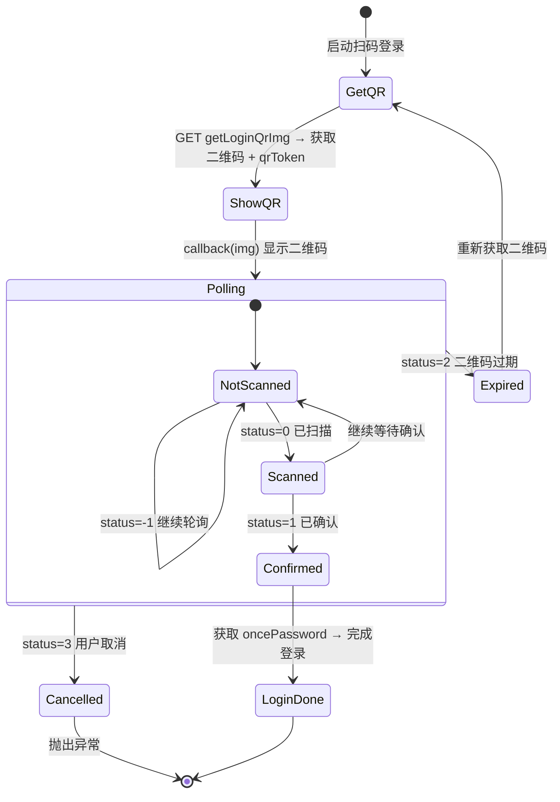

### 2.6 zhidao/ — 知到共享课程

#### 2.6.1 models.py

```python
from pydantic import BaseModel

class CourseInfo(BaseModel):
    """课程基本信息"""
    course_id: int
    name: str
    en_name: str = ""

class ZhidaoCourse(BaseModel):
    """知到课程"""
    secret: str               # recruitAndCourseId
    course_name: str
    course_info: CourseInfo | None = None
    recruit_id: int | None = None

class VideoChapter(BaseModel):
    """章节"""
    id: int
    name: str
    video_lessons: list[VideoLesson] = []

class VideoLesson(BaseModel):
    """课时"""
    id: int
    name: str
    lesson_id: int = 0
    video_id: int = 0
    chapter_id: int = 0
    video_small_lessons: list[VideoSmallLesson] = []
    watch_state: int = 0
    study_total_time: int = 0

class VideoSmallLesson(BaseModel):
    """子视频"""
    video_id: int
    id: int = 0
    name: str = ""
    lesson_id: int = 0
    chapter_id: int = 0
    video_sec: int = 0
    watch_state: int = 0
    study_total_time: int = 0

class QuestionPoint(BaseModel):
    """弹窗题目时间点"""
    time_sec: int
    question_ids: list[int]

class PopupQuestion(BaseModel):
    """弹窗题目详情"""
    question_id: int
    question_options: list[QuestionOption]

class QuestionOption(BaseModel):
    """题目选项"""
    id: int
    content: str = ""
    result: str = ""          # '1' 为正确答案

class ZhidaoContext(BaseModel):
    """知到课程上下文（缓存）"""
    course: ZhidaoCourse
    chapters: VideoChapterList
    videos: dict[int, VideoSmallLesson]
    fucked_time: int = 0      # 已刷秒数（用于时间限制检查）
    # cookies 和 headers 不放入模型，由 session 管理
```

#### 2.6.2 course.py

```python
class ZhidaoCourseManager:
    """知到课程管理"""

    def __init__(self, session: ZhsSession) -> None: ...
    def get_course_list(self) -> list[ZhidaoCourse]: ...
    def get_context(self, rac_id: str, force: bool = False) -> ZhidaoContext: ...
    def gologin(self, rac_id: str) -> None: ...
    def query_course(self, rac_id: str) -> CourseInfo: ...
    def video_list(self, rac_id: str) -> VideoChapterList: ...
    def query_study_info(self, lesson_ids: list, video_ids: list, recruit_id: int) -> dict: ...
```

#### 2.6.3 video.py

```python
class ZhidaoVideoPlayer:
    """知到视频播放器"""

    def __init__(
        self,
        session: ZhsSession,
        speed: float | None = None,
        end_threshold: float = 0.91,
        time_limit: int = 0,           # 分钟
        progressbar_view: bool = True,
    ) -> None: ...

    def play_course(self, rac_id: str) -> None: ...
    def play_video(self, rac_id: str, video_id: int) -> None: ...

    # 内部方法
    def _main_loop(self, ctx: ZhidaoContext, video: VideoSmallLesson, ...) -> None:
        """视频播放主循环"""
    def _watch_video(self, video_id: int) -> None:
        """在新线程中请求视频流（反检测）

        ⚠️ 线程安全设计：
        - 使用独立的 httpx.Client 实例（非共享 session），避免 Cookie 容器并发修改
        - 仅复制必要的 headers（User-Agent, Referer），不共享动态参数
        - 线程内捕获所有异常并记录日志，不向上传播
        - 使用 daemon=True + 超时控制，防止线程泄漏
        - 主线程不依赖子线程返回值，仅 fire-and-forget
        """
    def _report_progress_v2(self, ...) -> None:
        """上报进度 V2"""
```

**线程安全分析**：

| 风险 | 解决方案 |
|------|----------|
| Cookie 容器非线程安全 | `_watch_video` 使用独立的 `httpx.Client`，不共享 session 的 cookies |
| Headers 与动态参数覆盖 | 子线程仅复制静态 headers（User-Agent），不修改主 session 的任何状态 |
| 异常捕获盲区 | 子线程内部 `try/except Exception` 全捕获 + `loguru.error` 记录 |
| 线程泄漏 | `daemon=True` + `timeout=30` 超时控制，主循环不 `join()` 等待 |

**视频播放主循环流程**：


#### 2.6.4 quiz.py

```python
class ZhidaoQuizzer:
    """知到弹窗答题器"""

    def __init__(self, session: ZhsSession) -> None: ...
    def answer_question(self, question: PopupQuestion) -> str:
        """自动选择正确答案（result == '1' 的选项 ID，逗号分隔）"""
    def load_video_pointer_info(self, rac_id: str, video_id: int) -> list[QuestionPoint]: ...
    def get_popup_exam(self, rac_id: str, video_id: int, question_ids: list[int]) -> PopupQuestion: ...
    def save_answer(self, rac_id: str, video_id: int, question_id: int, answer: str) -> None: ...
```

### 2.7 hike/ — 职教云课程

#### 2.7.1 models.py

```python
class HikeCourse(BaseModel):
    course_id: int
    course_name: str

class ResourceNode(BaseModel):
    """资源树节点"""
    id: int
    name: str
    data_type: int | None = None     # 3=视频, None=测验, 其他=文件
    study_time: int | None = None
    total_time: int = 0
    child_list: list[ResourceNode] | None = None

class FileInfo(BaseModel):
    file_id: int
    data_id: int
    total_time: int
```

#### 2.7.2 course.py

```python
class HikeCourseManager:
    def __init__(self, session: ZhsSession) -> None: ...
    def get_course_list(self) -> list[HikeCourse]: ...
    def get_context(self, course_id: str) -> ResourceNode: ...
    def query_resource_menu_tree(self, course_id: str) -> list[ResourceNode]: ...
```

#### 2.7.3 video.py

```python
class HikeVideoPlayer:
    def __init__(self, session: ZhsSession, speed: float | None = None, ...) -> None: ...
    def play_course(self, course_id: str) -> None: ...
    def play_video(self, course_id: str, file_id: str, prev_time: int = 0) -> None: ...
    def play_file(self, course_id: str, file_id: str) -> None: ...
    def _traverse(self, course_id: str, node: ResourceNode, depth: int = 0) -> None:
        """递归遍历资源树"""
```

**Hike 资源树遍历逻辑**：

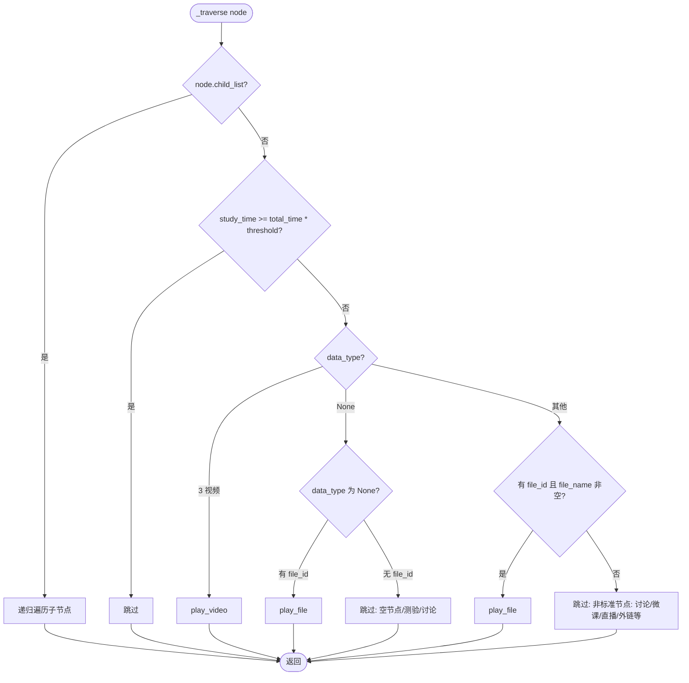

**Hike 资源树遍历关键细节**：
- `data_type=3`（视频）→ `play_video`
- `data_type=None` 且有 `file_id` → `play_file`（可能是普通文件）
- `data_type=None` 且无 `file_id` → 跳过（测验、讨论帖等空节点）
- 其他 `data_type`（1/2/4 等）→ 检查 `file_id` 和 `file_name` 是否存在，存在则 `play_file`，否则跳过
- 非标准节点（讨论帖子、微课链接、直播回放、外部跳转链接等）无 `file_id`，自动跳过并记录日志
- `play_file` 内部对 API 返回做 try/except 防护，避免非标准文件导致 KeyError 崩溃

### 2.8 ai/ — AI 课程

#### 2.8.1 models.py

```python
class KnowledgePoint(BaseModel):
    knowledge_id: int
    knowledge_name: str
    study_progress: int = 0       # 0-100

class Theme(BaseModel):
    theme_name: str
    knowledge_list: list[KnowledgePoint] = []

class AiCourseInfo(BaseModel):
    course_name: str
    cake_theme_list: list[Theme] = []

class ResourceDetail(BaseModel):
    resources_uid: int
    resources_name: str
    resources_type: int           # 1=视频/PPT, 2=文本/课程视频
    resources_distribute_type: int  # 1=文本, 2=课程视频, 3=视频, 4=PPT
    resources_url: str = ""
    resources_file_id: int = 0

class Resource(BaseModel):
    study_status: int = 0         # 0=未完成, 1=已完成
    resources_detail: ResourceDetail

class ExamInfo(BaseModel):
    exam_test_id: int
    paper_id: int
    mastery_score: int = 0

class QuestionSheet(BaseModel):
    question_id: int
    version: int = 1

class QuestionContent(BaseModel):
    id: int
    content: str
    question_type: int            # 1=单选, 2=多选, 3=填空, 14=判断
    option_vos: list[OptionVo] = []
    version: int = 1

class OptionVo(BaseModel):
    id: int
    content: str = ""
    is_correct: int = 0          # 1=正确答案（提交后返回）

class AnswerCache(BaseModel):
    version: int = 1
    question: str = ""
    answer: str = ""             # 选项 ID 用 #@# 分隔
    answer_content: str = ""     # 选项文本用换行分隔
    question_dict: dict = {}
```

#### 2.8.2 course.py

```python
class AiCourseManager:
    def __init__(self, session: ZhsSession) -> None: ...
    def get_course_list(self) -> list: ...
    def get_knowledge_points(self, course_id: int, class_id: int) -> AiCourseInfo: ...
    def list_knowledge_resources(self, course_id: int, class_id: int, knowledge_id: int) -> list[Resource]: ...
    def complete_resource(self, course_id: int, class_id: int, knowledge_id: int, resources_uid: int) -> None: ...
    def play_video(self, course_id: int, class_id: int, file_id: int, knowledge_id: int) -> None: ...
    def report_video_progress(self, course_id: int, class_id: int, file_id: int, ...) -> bool: ...
    def run_course(self, course_id: int, class_id: int, ai_config: AIConfig, no_exam: bool = False) -> None:
        """执行完整 AI 课程学习流程"""
```

**AI 课程学习流程**：

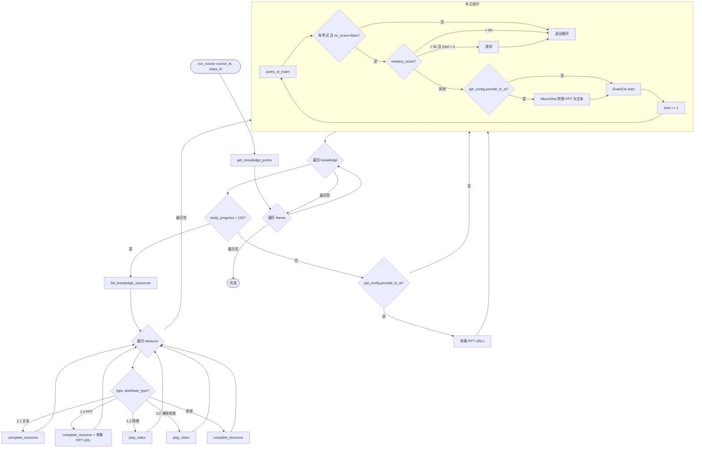

#### 2.8.3 exam.py — AI 考试（异步）

```python
class ExamCtx:
    """AI 考试上下文（异步执行）"""

    def __init__(
        self,
        session: ZhsSession,
        course_id: int,
        knowledge_id: int,
        exam_test_id: int,
        exam_paper_id: int,
        ai_config: AIConfig,
        op_extra: dict = {},
        progress_view: bool = True,
    ) -> None: ...

    async def start(self, reference_materials: list[dict] | None = None) -> tuple[bool, int, int]:
        """执行完整考试流程，返回 (是否全对, 正确数, 总题数)"""

    # --- 考试 API（均含 3 次重试） ---
    async def _open_exam(self) -> None: ...
    async def _get_sheet_content(self) -> list[QuestionSheet]: ...
    async def _get_question_content(self, question_id: int, version: int) -> QuestionContent | None: ...
    async def _save_answer(self, question_id: int, answers: list[str]) -> bool: ...
    async def _submit_exam(self) -> None: ...

    # --- 心跳 ---
    async def _heartbeat(self, interval: int = 10) -> None:
        """异步心跳，定期更新考试用时（updateUserUsedTime）"""

    # --- 答题 ---
    def _get_answer(self, question: QuestionContent) -> tuple[list[str], str]:
        """获取答案，返回 (答案列表, 来源标记)"""
        # 1. 查缓存 → (answer, "cached")
        # 2. AI 生成 → (answer, "AI generated")
        # 3. 兜底随机 → (answer, "random")

    # --- 并发控制 ---
    _semaphore: asyncio.Semaphore = asyncio.Semaphore(3)
    """限制同时进行的 API 请求数为 3，防止缓存命中时请求风暴"""

    async def _process_question(self, sheet: QuestionSheet) -> None:
        """处理单道题目（含并发控制和延迟）
        - async with self._semaphore: 限制并发
        - await asyncio.sleep(random.uniform(0.3, 0.8)): 每题间随机延迟
        """

    # --- 缓存 ---
    def _load_cache(self) -> None: ...
    def _save_cache(self) -> None: ...
    def _get_cached_answer(self, question_id: int, version: int) -> list[str] | None: ...
    def _set_cached_answer(self, question_id: int, version: int, data: dict) -> None: ...
```

**异步考试流程**：

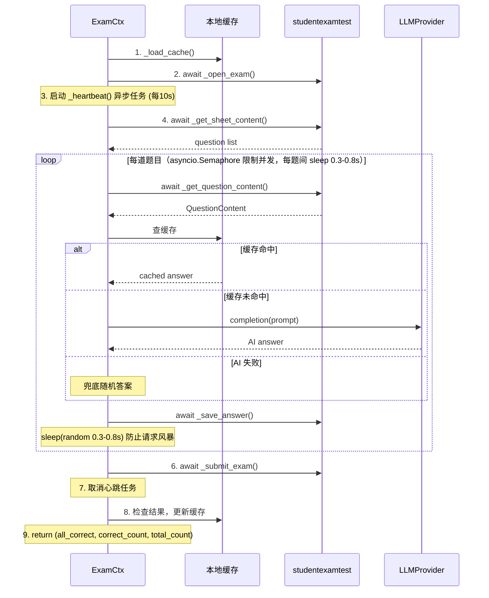

#### 2.8.4 ppt.py — PPT 转文本

```python
class PptConverter:
    """PPT 转文本（MoonShot API）"""

    def __init__(
        self,
        api_key: str,
        base_url: str = "https://api.moonshot.cn/v1",
        max_file_size_mb: int = 100,
        max_cache_files: int = 500,
        max_cache_size_gb: int = 8,
        delete_after_convert: bool = True,
        cleanup_local: bool = True,
    ) -> None: ...

    def convert(self, url: str) -> str:
        """下载 PPT 并转为文本，完成后清理本地临时文件"""

    # 内部方法
    def _download(self, url: str) -> Path: ...
    def _upload(self, file_path: Path) -> str: ...    # 返回 file_id
    def _extract(self, file_id: str) -> str:
        """提取文本，先尝试 JSON 解析取 content 字段，失败则返回原始文本"""
    def _delete_remote(self, file_id: str) -> None: ...
    def _cleanup_local(self, file_path: Path) -> None:
        """清理本地临时 .ppt/.pptx 文件，防止磁盘占用累积"""
    def _manage_cache(self) -> None:
        """按 LRU 策略清理远程缓存（超过 max_cache_files 或 max_cache_size_gb）"""
```

**PPT 转文本关键细节**：
- `convert` 流程：`_download` → `_upload` → `_extract` → `_delete_remote`（若 delete_after_convert）→ `_cleanup_local`（若 cleanup_local）
- `cleanup_local=True`（默认）：转换完成后自动删除本地下载的临时文件，防止大文件课程占满磁盘
- `cleanup_local=False`：保留本地文件，便于调试或离线复用

### 2.9 llm/ — LLM 答题模块

#### 2.9.1 base.py

```python
from abc import ABC, abstractmethod

class LLMProvider(ABC):
    """LLM 提供者抽象基类"""

    @abstractmethod
    def completion(self, prompt: str, aim_start: str = "```answer", aim_end: str = "```") -> str: ...

    # 模板方法
    def single_choice(self, question: str, choices: list[dict], reference: list[dict] = []) -> str: ...
    def multiple_choice(self, question: str, choices: list[dict], reference: list[dict] = []) -> str: ...
    def judgement(self, question: str, choices: list[dict], reference: list[dict] = []) -> str: ...
    def fill_blank(self, question: str, reference: list[dict] = []) -> str: ...

    # 答案解析
    def parse_choice_answer(self, completion: str) -> list[int]:
        """从 ```answer\n[{"id": ..., "content": ...}]\n``` 提取选项 ID 列表"""

    def parse_fill_blank_answer(self, completion: str) -> list[str]:
        """从 ```answer\n答案1\n答案2\n``` 按行提取"""
```

#### 2.9.2 openai.py

```python
class OpenAIProvider(LLMProvider):
    """OpenAI 兼容接口"""

    def __init__(
        self,
        api_key: str,
        base_url: str = "https://api.openai.com",
        model_name: str = "gpt-4",
        stream: bool = False,
        extra: dict = {},
    ) -> None: ...

    def completion(self, prompt: str, aim_start: str, aim_end: str) -> str: ...
```

#### 2.9.3 zhidao.py

```python
class ZhidaoAIProvider(LLMProvider):
    """智慧树内置 AI（moonshot-v1-32k）"""

    def __init__(
        self,
        session: ZhsSession,
        stream: bool = False,
        extra: dict = {},
    ) -> None: ...

    def completion(self, prompt: str, aim_start: str, aim_end: str) -> str: ...
```

#### 2.9.4 prompts.py

```python
def build_choice_prompt(
    question: str,
    choices: list[dict],
    answer_type: str,           # "单选题" | "多选题" | "判断题"
    reference_materials: list[dict] = [],
    extra: dict = {},
) -> str: ...

def build_fill_blank_prompt(
    question: str,
    reference_materials: list[dict] = [],
    extra: dict = {},
) -> str: ...
```

**Prompt 模板结构**：

```mermaid
flowchart TD
    subgraph ChoicePrompt[选择题/判断题 Prompt]
        Ref1["[参考资料（如有）]"]
        Ctx1["假设你是一名学生，正在学习《{courseName}》。\n现在，你学习到了{theme}。\n本次考察知识点为{knowledgePoint}。"]
        Instruct1["本题为{answer_type}，请从选项中选择{最合适的答案/所有正确的答案}，\n回答放到 markdown 代码块中"]
        Format1["```answer\n[{id: xxx, content: xxx}]\n```"]
        Q1["{question}"]
        Choices1["```choices\n{choices_json}\n```"]
        Ref1 --> Ctx1 --> Instruct1 --> Format1 --> Q1 --> Choices1
    end

    subgraph FillBlankPrompt[填空题 Prompt]
        Ref2["[参考资料（如有）]"]
        Ctx2["假设你是一名学生..."]
        Instruct2["本题为填空题，请填写空白处内容，\n每空一行，放到 markdown 代码块中"]
        Format2["```answer\n答案1\n答案2\n```"]
        Q2["{question}"]
        Ref2 --> Ctx2 --> Instruct2 --> Format2 --> Q2
    end
```

### 2.10 utils/ — 工具模块

#### 2.10.1 display.py

```python
def progress_bar(
    iteration: int,
    total: int,
    prefix: str = "",
    suffix: str = "",
    length: int | None = None,
    fill: str = "#",
    enabled: bool = True,
) -> None: ...

def show_qr_image(
    img_bytes: bytes,
    show_in_terminal: bool = False,
    ensure_unicode: bool = False,
) -> None: ...

def terminal_qr_unicode(img_bytes: bytes) -> None: ...
def terminal_qr_tty(img_bytes: bytes) -> None: ...

def tree_print(text: str, depth: int, width_limit: int = 80, prefix: str = "  |") -> None: ...
def wipe_line() -> None: ...
```

#### 2.10.2 cookie.py

```python
def cookies_to_list(cookies: httpx.Cookies) -> list[dict]: ...
def list_to_cookies(data: list[dict]) -> httpx.Cookies: ...
```

#### 2.10.3 path.py

```python
def get_data_dir() -> Path:
    """获取数据目录（~/.zhs/ 或项目目录）"""

def get_config_path() -> Path: ...
def get_real_path(path: str) -> Path: ...
```

### 2.11 logger.py — 日志模块

基于 loguru 的生产级日志系统，替代旧版自定义 MonoLogger。

#### 2.11.1 设计目标

| 目标 | 说明 |
|------|------|
| 零配置可用 | 模块内 `from loguru import logger` 直接使用，无需手动初始化 |
| 一次性配置 | CLI 入口调用 `setup_logging(config)` 完成所有 sink 注册 |
| 双通道 | stderr（控制台实时）+ 文件（持久化审计） |
| 敏感信息脱敏 | 自动过滤 cookie/token/password 等字段 |
| 文件轮转 | 单文件 10 MB，保留 7 天，自动压缩 |
| 线程安全 | loguru 本身线程安全，无需额外同步 |

#### 2.11.2 公开 API

```python
from zhs.config import AppConfig

def setup_logging(config: AppConfig) -> None:
    """
    配置 loguru 日志系统。

    - 移除 loguru 默认 sink（id=0）
    - 注册 stderr sink（级别由 config.log_level 控制）
    - 注册文件 sink（始终 DEBUG，轮转 10MB/7天）
    - 注册敏感信息过滤 patcher
    - 确保幂等：重复调用不会重复注册 sink
    """

def get_log_dir() -> Path:
    """返回日志文件目录路径（<data_dir>/logs/），自动创建"""

# 敏感信息过滤的正则模式（内部使用，但文档化以便审查）
_SENSITIVE_PATTERNS: tuple[re.Pattern[str], ...] = (
    # 匹配 "CASLOGC=xxx", "token=xxx", "password=xxx" 等
    # 替换为 "***"
)
```

#### 2.11.3 格式定义

**控制台格式**（紧凑、彩色）：

```
14:23:01 | INFO    | 登录成功: uuid=Xe6arnRO
14:23:02 | DEBUG   | API 请求: url=/login/gologin
14:23:03 | WARNING | 视频进度异常: played=0.8 end=1.0
14:23:04 | ERROR   | API 请求失败: code=-12
```

格式串：`<green>{time:HH:mm:ss}</green> | <level>{level:<7}</level> | <cyan>{name}</cyan>:<cyan>{function}</cyan> - {message}`

**文件格式**（完整、结构化）：

```
2026-06-13 14:23:01.123 | INFO     | MainThread | zhs.login:login_with_qr:89 | 登录成功: uuid=Xe6arnRO
2026-06-13 14:23:02.456 | DEBUG    | Thread-3   | zhs.zhidao.video:_watch_video:142 | API 请求: url=/login/gologin
```

格式串：`{time:YYYY-MM-DD HH:mm:ss.SSS} | {level:<8} | {thread.name} | {name}:{function}:{line} | {message}`

#### 2.11.4 敏感信息过滤

通过 loguru 的 `patcher` 机制，在日志记录创建时自动脱敏：

```python
def _sensitive_patcher(record: loguru.Record) -> None:
    """对 record["message"] 中的敏感字段进行脱敏"""
    for pattern in _SENSITIVE_PATTERNS:
        record["message"] = pattern.sub(r'\1=***', record["message"])
```

脱敏规则：

| 模式 | 示例输入 | 脱敏后 |
|------|----------|--------|
| `CASLOGC=<value>` | `CASLOGC=%7B%22uuid%22...%7D` | `CASLOGC=***` |
| `token=<value>` | `token=abc123def` | `token=***` |
| `password=<value>` | `password=mysecret` | `password=***` |
| `apiKey=<value>` | `apiKey=sk-xxxx` | `apiKey=***` |
| `Authorization: Bearer <value>` | `Authorization: Bearer eyJ...` | `Authorization: Bearer ***` |

#### 2.11.5 初始化流程

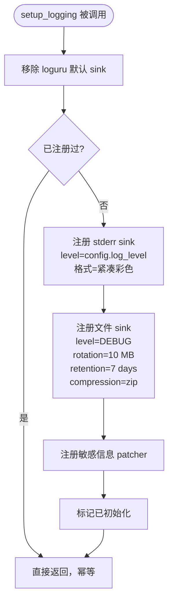

#### 2.11.6 与其他模块的交互

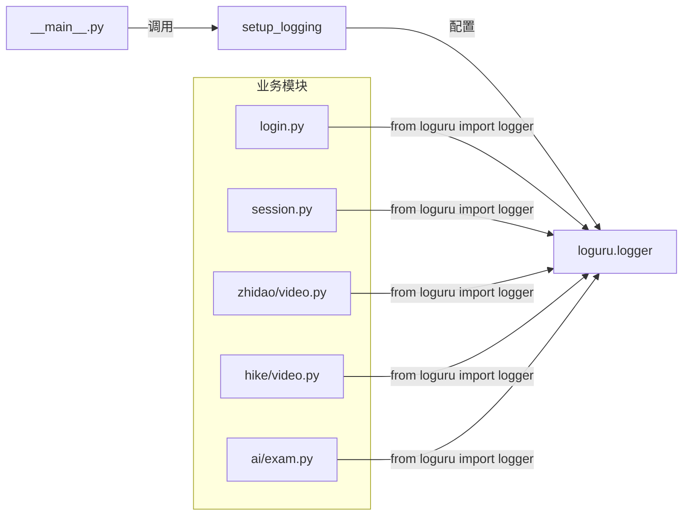

关键点：
- 所有业务模块统一使用 `from loguru import logger`，不直接依赖 `logger.py`
- `logger.py` 仅负责**配置**（sink 注册、格式、过滤），不提供自定义 logger 实例
- 这意味着 `setup_logging()` 必须在业务逻辑之前调用（CLI 入口负责）

#### 2.11.7 线程安全考量

| 场景 | loguru 行为 | 结论 |
|------|-------------|------|
| 多线程写日志 | 内部有锁，消息不会交错 | 安全 |
| `_watch_video` daemon 线程 | 线程内 logger 调用正常 | 安全 |
| 异步协程写日志 | loguru 不依赖线程本地存储 | 安全 |
| 运行时修改 sink | `logger.add()`/`logger.remove()` 线程安全 | 安全 |

#### 2.11.8 AppConfig 扩展

`AppConfig.log_level` 已存在（默认 `"INFO"`），无需新增字段。

TOML 配置示例：

```toml
[app]
log_level = "DEBUG"   # 控制台日志级别，文件始终 DEBUG
```

### 2.12 __main__.py — CLI 入口

```python
import typer

app = typer.Typer(name="zhs", help="智慧树自动刷课工具")

@app.command()
def main(
    course: list[str] | None = typer.Option(None, "-c", "--course", help="课程 ID"),
    course_type: str | None = typer.Option(None, "--type", help="课程类型: zhidao/hike/ai，覆盖自动检测"),
    videos: list[str] | None = typer.Option(None, "-v", "--videos", help="视频 ID"),
    speed: float | None = typer.Option(None, "-s", "--speed", help="播放速度"),
    threshold: float | None = typer.Option(None, "-t", "--threshold", help="完成阈值"),
    limit: int = typer.Option(0, "-l", "--limit", help="时间限制(分钟)"),
    debug: bool = typer.Option(False, "-d", "--debug", help="调试模式"),
    fetch: bool = typer.Option(False, "-f", "--fetch", help="获取课程列表"),
    show_in_terminal: bool = typer.Option(False, help="终端显示二维码"),
    proxy: str | None = typer.Option(None, "--proxy", help="代理"),
    tree_view: bool | None = typer.Option(None, help="树形视图"),
    progressbar_view: bool | None = typer.Option(None, help="进度条"),
    image_path: str | None = typer.Option(None, "--image-path", help="二维码保存路径"),
    aicourse: list[str] | None = typer.Option(None, "-ai", "--aicourse", help="AI 课程 ID 和班级 ID"),
    noexam: bool = typer.Option(False, "--noexam", help="禁用 AI 考试"),
) -> None:
    """智慧树自动刷课工具"""
    ...
```

**CLI 执行主流程**：

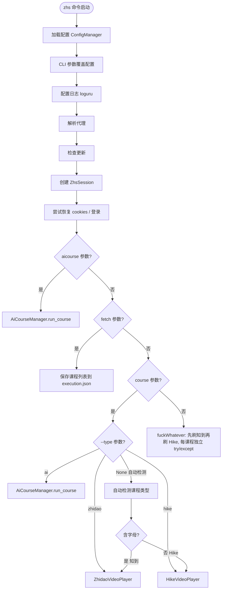

**课程类型检测说明**：
- `--type` 参数优先级最高，显式指定 `zhidao`/`hike`/`ai` 时直接路由，跳过自动检测
- 自动检测（"含字母→知到，纯数字→Hike"）仅作为 fallback，该规则脆弱但兼容旧版 ID 格式
- 若自动检测路由错误，用户可通过 `--type` 覆盖，如 `zhs -c 12345 --type hike`

---

## 3. 数据流

### 3.1 知到视频刷课数据流

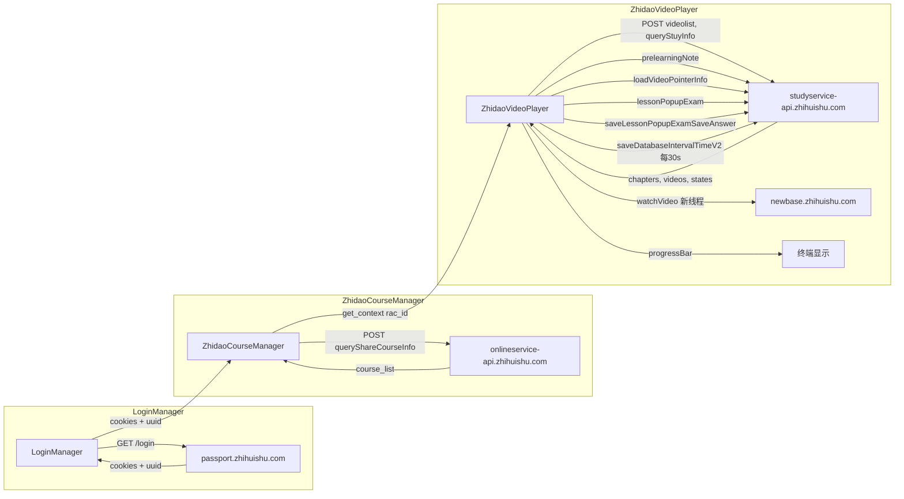

### 3.2 AI 考试数据流

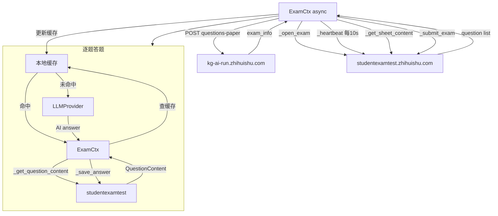

---

## 4. 测试策略

### 4.1 TDD 开发流程

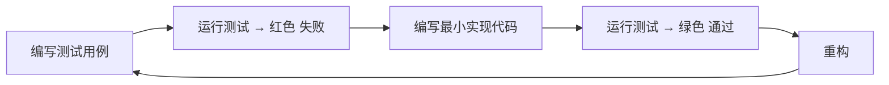

### 4.2 测试分层

| 层级 | 覆盖内容 | Mock 策略 |
|------|----------|-----------|
| **单元测试** | crypto、models、prompts、cookie、path | 无外部依赖 |
| **集成测试** | session API 查询、login 流程 | Mock httpx 响应 |
| **端到端测试** | 完整刷课流程 | Mock 全部 API |

### 4.3 关键测试用例

**crypto.py**：
- AES 加解密对称性
- ev 编解码对称性
- Hike 签名与已知结果对比
- WatchPoint 生成逻辑

**session.py**：
- zhidao_query 自动加密和时间戳
- hike_query 自动签名
- Cookie 解析 uuid
- API 错误码映射异常

**config.py**：
- TOML 加载/保存
- 旧版 JSON 配置迁移
- 默认值填充

**llm/prompts.py**：
- Prompt 模板输出格式
- 答案解析（正常/异常格式）

**ai/exam.py**：
- 缓存命中/未命中
- 考试重试逻辑（mastery_score 阈值）
- 异步心跳启停

### 4.4 Mock 示例

```python
# tests/conftest.py
import pytest
from unittest.mock import AsyncMock
from zhs.session import ZhsSession

@pytest.fixture
def mock_session():
    session = ZhsSession()
    session.sync_client = MagicMock()
    session.async_client = MagicMock()
    return session

@pytest.fixture
def mock_api_response():
    """通用 API 响应工厂"""
    def _make(code: int = 0, data: dict = {}, message: str = ""):
        return {"code": code, "data": data, "message": message, "status": code}
    return _make
```

---

## 5. 开发顺序

按依赖关系从底层到上层：

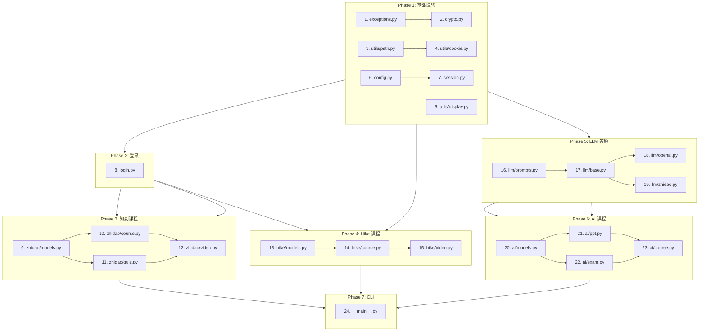

每个 Phase 内的模块可并行开发，Phase 间有依赖需顺序完成。