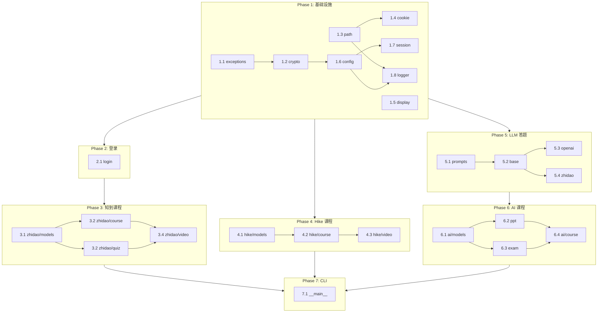

# ZHS 开发任务清单

> 基于 [design.md](./design.md) 的模块设计和 [test.md](./test.md) 的 TDD 测试计划，
> 将开发工作拆解为可执行的原子任务。每个任务严格遵循 Red → Green → Refactor 循环。

---

## Phase 1: 基础设施

### Task 1.1 — exceptions.py

- **文件**: `src/zhs/exceptions.py`
- **测试**: `tests/test_exceptions.py`
- **依赖**: 无
- **TDD 步骤**:

| # | Red（写测试） | Green（最小实现） | Refactor |
|---|--------------|------------------|----------|
| 1 | `ZhsError` 可被 `except ZhsError` 捕获 | 定义 `class ZhsError(Exception)` | — |
| 2 | `ApiError` 携带 `code` 和 `message` | `ApiError(ZhsError)` + `__init__(code, message)` | `__str__` 包含 code |
| 3 | `CaptchaRequired` 继承 `ZhsError` | 定义子类 | — |
| 4 | `LoginFailed` 继承 `ZhsError` | 定义子类 | — |
| 5 | `InvalidCookies` 继承 `ZhsError` | 定义子类 | — |
| 6 | `TimeLimitExceeded` 继承 `ZhsError` | 定义子类 | — |

- **完成标准**: `pytest tests/test_exceptions.py` 全绿

---

### Task 1.2 — crypto.py

- **文件**: `src/zhs/crypto.py`
- **测试**: `tests/test_crypto.py`
- **依赖**: Task 1.1 (exceptions)
- **前置准备**: 从旧代码运行获取 AES/ev/Hike 签名的已知输入输出，写入 `tests/fixtures/crypto_vectors/`
- **TDD 步骤**:

| # | Red | Green | Refactor |
|---|-----|-------|----------|
| 1 | `Cipher(key, iv).encrypt("hello")` → `decrypt` 还原 | AES-128-CBC 实现 | — |
| 2 | 加密空字符串不崩溃 | PKCS7 padding 处理 | — |
| 3 | 加密中文 Unicode | 确认 UTF-8 编码 | — |
| 4 | 加密超长字符串 (>1MB) | 无特殊处理 | — |
| 5 | 不同密钥产生不同密文 | — | — |
| 6 | 与已知向量对比 | 确认兼容旧代码 | — |
| 7 | `encode_ev(data)` → `decode_ev` 还原 | ev 编解码实现 | — |
| 8 | 默认密钥 `zzpttjd` | 默认参数 | — |
| 9 | 自定义密钥 | 参数化 key | — |
| 10 | 空列表 | 边界处理 | — |
| 11 | `tmp[-4:]` 截断后仍可解码 | 截断逻辑 | — |
| 12 | `sign_hike(params, salt)` 与已知结果对比 | MD5 签名实现 | — |
| 13 | 字段顺序正确性 | 拼接顺序验证 | — |
| 14 | `sign_zhidao_ai` 返回含 `sign` 参数的 URL | URL 签名实现 | — |
| 15 | `sign_zhidao_ai` 生成 `chatcmpl-` 前缀的 sessionNid | sessionNid 生成 | 正则验证格式 |
| 16 | `WatchPoint(init=0).get()` 初始值 `[0, 1]` | WatchPoint 类 | — |
| 17 | `WatchPoint.add(100)` → gen(100)=22 | add/gen 逻辑 | — |
| 18 | `WatchPoint.reset()` 恢复初始状态 | reset 方法 | — |

- **完成标准**: `pytest tests/test_crypto.py` 全绿

---

### Task 1.3 — utils/path.py

- **文件**: `src/zhs/utils/path.py`
- **测试**: `tests/test_path.py`（需新建 `tests/utils/` 目录）
- **依赖**: 无
- **TDD 步骤**:

| # | Red | Green | Refactor |
|---|-----|-------|----------|
| 1 | `get_data_dir()` 返回 `~/.zhs/` 或项目目录 | 路径解析 | — |
| 2 | `get_config_path()` 返回正确路径 | 路径拼接 | — |
| 3 | `version_cmp("1.0.0", "2.0.0")` 返回 `<0` | 版本比较实现 | — |
| 4 | `version_cmp("2.0.0", "1.0.0")` 返回 `>0` | — | — |
| 5 | `version_cmp("1.0.0", "1.0.0")` 返回 `0` | — | — |
| 6 | `version_cmp("1.2.3", "1.2.4")` 语义化版本 | — | — |

- **完成标准**: `pytest tests/utils/test_path.py` 全绿

---

### Task 1.4 — utils/cookie.py

- **文件**: `src/zhs/utils/cookie.py`
- **测试**: `tests/utils/test_cookie.py`
- **依赖**: 无
- **TDD 步骤**:

| # | Red | Green | Refactor |
|---|-----|-------|----------|
| 1 | `cookies_to_list` → `list_to_cookies` 往返还原 | 序列化/反序列化 | — |
| 2 | 空 cookies 序列化/反序列化 | 边界处理 | — |
| 3 | 多 domain cookies 保留 domain 信息 | domain 字段保留 | — |

- **完成标准**: `pytest tests/utils/test_cookie.py` 全绿

---

### Task 1.5 — utils/display.py

- **文件**: `src/zhs/utils/display.py`
- **测试**: `tests/utils/test_display.py`
- **依赖**: 无
- **TDD 步骤**:

| # | Red | Green | Refactor |
|---|-----|-------|----------|
| 1 | `progress_bar(50, 100)` 不抛异常 | 进度条实现 | — |
| 2 | `progress_bar(0, 0)` 除零保护 | 边界处理 | — |
| 3 | `tree_print(text, depth)` 不抛异常 | 树形输出 | — |
| 4 | `wipe_line()` 不抛异常 | 行清除 | — |

- **完成标准**: `pytest tests/utils/test_display.py` 全绿

---

### Task 1.6 — config.py

- **文件**: `src/zhs/config.py`
- **测试**: `tests/test_config.py`
- **依赖**: Task 1.2 (crypto, CryptoConfig)
- **TDD 步骤**:

| # | Red | Green | Refactor |
|---|-----|-------|----------|
| 1 | `AppConfig()` 默认值正确 | pydantic 模型定义 | — |
| 2 | `CryptoConfig.key_bytes("video_key")` → `b"azp53h0kft7qi78q"` | key_bytes 方法 | — |
| 3 | `CryptoConfig.key_bytes("nonexistent")` → 抛异常 | 错误处理 | — |
| 4 | `ConfigManager.load()` 从 TOML 文件加载 | TOML 解析 | — |
| 5 | `ConfigManager.save()` 写入 TOML 文件 | TOML 写入 | — |
| 6 | `load()` → `save()` → `load()` 往返一致 | 序列化一致性 | — |
| 7 | 旧版 JSON 配置迁移到 `AppConfig` | migrate 方法 | — |
| 8 | TOML 缺失字段时使用默认值填充 | 默认值合并 | — |
| 9 | `UrlConfig` 默认值正确 | URL 配置模型 | — |
| 10 | `AIConfig` 默认值正确 | AI 配置模型 | — |

- **完成标准**: `pytest tests/test_config.py` 全绿

---

### Task 1.7 — session.py

- **文件**: `src/zhs/session.py`
- **测试**: `tests/test_session.py`
- **依赖**: Task 1.2 (crypto), Task 1.6 (config)
- **TDD 步骤**:

| # | Red | Green | Refactor |
|---|-----|-------|----------|
| 1 | `ZhsSession(config)` 初始化不报错 | 构造函数 | — |
| 2 | `session.cookies = {...}` → `session.uuid` 正确解析 | CASLOGC 解析 | — |
| 3 | `zhidao_query` 自动加密 data + 添加 dateFormate | 加密+时间戳 | — |
| 4 | `zhidao_query` 返回码 -12 抛 `CaptchaRequired` | 错误码映射 | — |
| 5 | `hike_query` 自动添加 `_` 时间戳 | 时间戳参数 | — |
| 6 | `hike_query` sig=True 时自动签名 | 签名集成 | — |
| 7 | `ai_exam_query` 异步版本正常工作 | async 方法 | — |
| 8 | `ai_exam_query` 密钥从 config.crypto.exam_key 获取 | 配置化密钥 | — |
| 9 | API 5xx 自动重试 | 重试逻辑 | — |
| 10 | Cookie 设置时自动添加 `exitRecod_{uuid}=2` | Cookie 钩子 | — |

- **完成标准**: `pytest tests/test_session.py` 全绿

---

### Task 1.8 — logger.py

- **文件**: `src/zhs/logger.py`
- **测试**: `tests/test_logger.py`
- **依赖**: Task 1.3 (utils/path, get_data_dir), Task 1.6 (config, AppConfig)
- **TDD 步骤**:

| # | Red | Green | Refactor |
|---|-----|-------|----------|
| 1 | `setup_logging(config)` 移除 loguru 默认 sink | 移除 id=0 | — |
| 2 | `setup_logging` 注册 stderr sink，级别由 config.log_level 控制 | stderr sink | — |
| 3 | `setup_logging` 注册文件 sink，始终 DEBUG | 文件 sink | — |
| 4 | 文件 sink 轮转 10MB + 保留 7 天 + zip 压缩 | rotation/retention/compression | — |
| 5 | `setup_logging` 幂等：重复调用不重复注册 | _initialized 标志 | — |
| 6 | `get_log_dir()` 返回 `<data_dir>/logs/` 并自动创建 | get_log_dir | — |
| 7 | `_SENSITIVE_PATTERNS` 脱敏 CASLOGC | 正则模式 | — |
| 8 | `_SENSITIVE_PATTERNS` 脱敏 token/password/apiKey | 正则模式 | — |
| 9 | `_SENSITIVE_PATTERNS` 脱敏 Authorization Bearer | 正则模式 | — |
| 10 | `_SENSITIVE_PATTERNS` 不影响普通文本 | 负向测试 | — |
| 11 | patcher 与 loguru 集成后日志消息自动脱敏 | _sensitive_patcher | — |
| 12 | 控制台格式包含时间戳+级别+消息 | 格式验证 | — |
| 13 | 文件格式包含线程名+模块名+行号 | 格式验证 | — |

- **完成标准**: `pytest tests/test_logger.py` 全绿

---

## Phase 2: 登录

### Task 2.1 — login.py

- **文件**: `src/zhs/login.py`
- **测试**: `tests/test_login.py`
- **依赖**: Task 1.7 (session)
- **TDD 步骤**:

| # | Red | Green | Refactor |
|---|-----|-------|----------|
| 1 | 扫码：获取二维码 → 轮询 → 确认 → 登录 | login_qrcode 完整流程 | — |
| 2 | 扫码 status=2 过期 → 递归重试 | 过期重试 | — |
| 3 | 扫码 status=3 取消 → 抛异常 | 取消处理 | — |
| 4 | 扫码 status=0 仅提示一次"已扫描" | 去重提示 | — |
| 5 | Cookie 恢复登录成功 | restore_cookies | — |
| 6 | Cookie 过期 → 重新登录 | 过期检测 | — |

- **完成标准**: `pytest tests/test_login.py` 全绿

---

## Phase 3: 知到课程

### Task 3.1 — zhidao/models.py

- **文件**: `src/zhs/zhidao/models.py`
- **测试**: `tests/zhidao/test_models.py`
- **依赖**: 无
- **TDD 步骤**:

| # | Red | Green | Refactor |
|---|-----|-------|----------|
| 1 | `ZhidaoCourse` 从 API JSON 构建 | pydantic 模型 | alias 映射 |
| 2 | `VideoSmallLesson` 默认值正确 | 可选字段 | — |
| 3 | `ZhidaoContext` 不含 cookies/headers 字段 | 排除敏感字段 | — |

- **完成标准**: `pytest tests/zhidao/test_models.py` 全绿

---

### Task 3.2 — zhidao/course.py

- **文件**: `src/zhs/zhidao/course.py`
- **测试**: `tests/zhidao/test_course.py`
- **依赖**: Task 1.7 (session), Task 3.1 (models)
- **TDD 步骤**:

| # | Red | Green | Refactor |
|---|-----|-------|----------|
| 1 | `get_course_list()` 返回课程列表 | API 调用 + 解析 | — |
| 2 | `get_context()` 返回 `ZhidaoContext` | 上下文构建 | — |
| 3 | `get_context()` 已看完课程 → end_threshold 检查 | 进度判断 | — |

- **完成标准**: `pytest tests/zhidao/test_course.py` 全绿

---

### Task 3.3 — zhidao/quiz.py

- **文件**: `src/zhs/zhidao/quiz.py`
- **测试**: `tests/zhidao/test_quiz.py`
- **依赖**: Task 1.7 (session), Task 3.1 (models)
- **TDD 步骤**:

| # | Red | Green | Refactor |
|---|-----|-------|----------|
| 1 | 获取弹窗题目列表 | API 调用 | — |
| 2 | 过滤已答题目（timeSec <= played_time） | 过滤逻辑 | — |
| 3 | 答题延迟机制（answer_delay=2 递减） | 延迟递减 | — |

- **完成标准**: `pytest tests/zhidao/test_quiz.py` 全绿

---

### Task 3.4 — zhidao/video.py

- **文件**: `src/zhs/zhidao/video.py`
- **测试**: `tests/zhidao/test_video.py`
- **依赖**: Task 3.2 (course), Task 3.3 (quiz)
- **TDD 步骤**:

| # | Red | Green | Refactor |
|---|-----|-------|----------|
| 1 | 已看完视频 → 跳过 | end_threshold 检查 | — |
| 2 | `played_time = min(played_time + speed, end_time)` 截断 | 进度截断 | — |
| 3 | 随机暂停 0.25% → played_time 不前进 | 暂停逻辑 | — |
| 4 | `saveDatabaseIntervalTimeV2` initial=True 格式 | ev 初始格式 | — |
| 5 | `saveDatabaseIntervalTimeV2` initial=False 格式（ewssw/sdsew/zwsds） | ev 常规格式 | — |
| 6 | `_watch_video` 使用独立 httpx.Client | 线程安全 | — |
| 7 | `_watch_video` daemon=True + timeout | 线程属性 | — |
| 8 | 弹窗答题 answer_delay 机制 | 集成 quiz | — |
| 9 | 人类延迟 sleep(random+1) | 随机延迟 | — |

- **完成标准**: `pytest tests/zhidao/test_video.py` 全绿

---

## Phase 4: Hike 课程

### Task 4.1 — hike/models.py

- **文件**: `src/zhs/hike/models.py`
- **测试**: `tests/hike/test_models.py`
- **依赖**: 无
- **TDD 步骤**:

| # | Red | Green | Refactor |
|---|-----|-------|----------|
| 1 | `HikeCourse` 从 API JSON 构建 | pydantic 模型 | alias 映射 |
| 2 | `HikeResourceNode` 递归子节点 | child_list 可选 | — |
| 3 | `data_type` 字段默认 None | 可选字段 | — |

- **完成标准**: `pytest tests/hike/test_models.py` 全绿

---

### Task 4.2 — hike/course.py

- **文件**: `src/zhs/hike/course.py`
- **测试**: `tests/hike/test_course.py`
- **依赖**: Task 1.7 (session), Task 4.1 (models)
- **TDD 步骤**:

| # | Red | Green | Refactor |
|---|-----|-------|----------|
| 1 | `get_course_list()` 返回课程列表 | API 调用 | — |
| 2 | `get_resource_tree()` 返回资源树 | 递归解析 | — |

- **完成标准**: `pytest tests/hike/test_course.py` 全绿

---

### Task 4.3 — hike/video.py

- **文件**: `src/zhs/hike/video.py`
- **测试**: `tests/hike/test_video.py`
- **依赖**: Task 4.2 (course)
- **TDD 步骤**:

| # | Red | Green | Refactor |
|---|-----|-------|----------|
| 1 | data_type=3 → play_video | 类型路由 | — |
| 2 | data_type=None + file_id → play_file | 文件处理 | — |
| 3 | data_type=None + 无 file_id → 跳过 | 空节点跳过 | — |
| 4 | 非标准 data_type + file_id → play_file | 安全检查 | — |
| 5 | 非标准 data_type + 无 file_id → 跳过 + 日志 | 非标准节点跳过 | — |
| 6 | `play_file` try/except 防护 KeyError | 异常防护 | — |
| 7 | `saveStuStudyRecord` 返回值覆盖 played_time | 时间同步 | — |
| 8 | `studyTime` 为 None 时默认 0 | None 防护 | — |
| 9 | 默认速度 1.25 | 速度配置 | — |

- **完成标准**: `pytest tests/hike/test_video.py` 全绿

---

## Phase 5: LLM 答题

### Task 5.1 — llm/prompts.py

- **文件**: `src/zhs/llm/prompts.py`
- **测试**: `tests/llm/test_prompts.py`
- **依赖**: 无
- **TDD 步骤**:

| # | Red | Green | Refactor |
|---|-----|-------|----------|
| 1 | 选择题 Prompt 包含 ` ```answer``` ` 标记 | 模板渲染 | — |
| 2 | 填空题 Prompt 包含 ` ```answer``` ` 标记 | 模板渲染 | — |
| 3 | `parse_choice_answer` 正常 JSON 格式 | JSON 解析 | — |
| 4 | `parse_choice_answer` 异常格式 → `ast.literal_eval` 兜底 | 兜底解析 | — |
| 5 | `parse_fill_blank_answer` 按行提取 | 行提取 | — |
| 6 | `parse_fill_blank_answer` 空输出 | 边界处理 | — |
| 7 | `_truncate_prompt` 超过 27900 token 截断 | tiktoken 截断 | — |

- **完成标准**: `pytest tests/llm/test_prompts.py` 全绿

---

### Task 5.2 — llm/base.py

- **文件**: `src/zhs/llm/base.py`
- **测试**: `tests/llm/test_base.py`
- **依赖**: Task 5.1 (prompts)
- **TDD 步骤**:

| # | Red | Green | Refactor |
|---|-----|-------|----------|
| 1 | `LLMProvider` 抽象基类定义 | Protocol/ABC | — |
| 2 | `completion` 抽象方法签名 | 方法签名 | — |
| 3 | `parse_answer` 调用 prompts 解析 | 集成 prompts | — |

- **完成标准**: `pytest tests/llm/test_base.py` 全绿

---

### Task 5.3 — llm/openai.py

- **文件**: `src/zhs/llm/openai.py`
- **测试**: `tests/llm/test_openai.py`
- **依赖**: Task 5.2 (base)
- **TDD 步骤**:

| # | Red | Green | Refactor |
|---|-----|-------|----------|
| 1 | OpenAI 兼容接口 completion | openai 库调用 | Mock |
| 2 | 流式响应解析 | stream=True | — |
| 3 | API 错误处理 | 异常映射 | — |

- **完成标准**: `pytest tests/llm/test_openai.py` 全绿

---

### Task 5.4 — llm/zhidao.py

- **文件**: `src/zhs/llm/zhidao.py`
- **测试**: `tests/llm/test_zhidao.py`
- **依赖**: Task 5.2 (base), Task 1.2 (crypto.sign_zhidao_ai)
- **TDD 步骤**:

| # | Red | Green | Refactor |
|---|-----|-------|----------|
| 1 | 智慧树内置 AI completion（含签名） | sign_zhidao_ai 集成 | Mock session |
| 2 | 流式响应解析 | SSE 解析 | — |
| 3 | API 错误处理 | 异常映射 | — |

- **完成标准**: `pytest tests/llm/test_zhidao.py` 全绿

---

## Phase 6: AI 课程

### Task 6.1 — ai/models.py

- **文件**: `src/zhs/ai/models.py`
- **测试**: `tests/ai/test_models.py`
- **依赖**: 无
- **TDD 步骤**:

| # | Red | Green | Refactor |
|---|-----|-------|----------|
| 1 | `AiKnowledgePoint` 从 API JSON 构建 | pydantic 模型 | — |
| 2 | `QuestionSheet` / `QuestionContent` 模型 | 考试题模型 | — |
| 3 | `AiResource` 资源类型字段 | resourceType 解析 | — |

- **完成标准**: `pytest tests/ai/test_models.py` 全绿

---

### Task 6.2 — ai/ppt.py

- **文件**: `src/zhs/ai/ppt.py`
- **测试**: `tests/ai/test_ppt.py`
- **依赖**: Task 6.1 (models)
- **TDD 步骤**:

| # | Red | Green | Refactor |
|---|-----|-------|----------|
| 1 | `PptConverter.convert` 完整流程 | download→upload→extract→cleanup | Mock MoonShot |
| 2 | `_cleanup_local` 删除临时文件 | 文件清理 | — |
| 3 | `cleanup_local=False` 保留文件 | 条件清理 | — |
| 4 | `_extract` JSON 解析优先 | JSON→content 字段 | — |
| 5 | `_extract` 纯文本兜底 | fallback | — |
| 6 | `_manage_cache` LRU 清理 | 缓存管理 | — |

- **完成标准**: `pytest tests/ai/test_ppt.py` 全绿

---

### Task 6.3 — ai/exam.py

- **文件**: `src/zhs/ai/exam.py`
- **测试**: `tests/ai/test_exam.py`
- **依赖**: Task 6.1 (models), Task 5.2 (base)
- **TDD 步骤**:

| # | Red | Green | Refactor |
|---|-----|-------|----------|
| 1 | `ExamCtx` 初始化 | 构造函数 | — |
| 2 | `_open_exam` / `_get_sheet_content` | 考试 API | Mock |
| 3 | `_process_question` Semaphore 限制并发 | 并发控制 | — |
| 4 | `_process_question` 每题 sleep 0.3-0.8s | 延迟控制 | — |
| 5 | 两级缓存：先查 all_answer_cache 再查 answer_cache | 缓存查找 | — |
| 6 | `_get_answer` 缓存命中 → 返回 | 缓存命中 | — |
| 7 | `_get_answer` 缓存未命中 → LLM → 返回 | LLM 调用 | — |
| 8 | `_get_answer` LLM 失败 → 兜底随机 | 兜底逻辑 | — |
| 9 | `_save_answer` 用 `#@#` 分隔选项 ID | 答案格式化 | — |
| 10 | `_submit_exam` 含 courseType=8 | 提交考试 | — |
| 11 | 选项少于 2 个且非填空 → 选第一个 | 边界处理 | — |
| 12 | 考试循环：mastery_score > 90 → 退出 | 通过判断 | — |
| 13 | 考试循环：mastery_score < 30 且 tried > 4 → 放弃 | 放弃判断 | — |
| 14 | `_heartbeat` 异步心跳 | 后台任务 | — |
| 15 | API 失败 3 次重试 | 重试逻辑 | — |

- **完成标准**: `pytest tests/ai/test_exam.py` 全绿

---

### Task 6.4 — ai/course.py

- **文件**: `src/zhs/ai/course.py`
- **测试**: `tests/ai/test_course.py`
- **依赖**: Task 6.2 (ppt), Task 6.3 (exam)
- **TDD 步骤**:

| # | Red | Green | Refactor |
|---|-----|-------|----------|
| 1 | `get_knowledge_points` 返回知识点列表 | API 调用 | — |
| 2 | 资源类型路由：2,1 文本 → complete_resource | 文本资源 | — |
| 3 | 资源类型路由：1,4 PPT → complete + 收集 URL | PPT 资源 | — |
| 4 | 资源类型路由：1,3 视频 → play_video（speed*2, 2s 间隔） | 视频资源 | — |
| 5 | `run_course` 完整流程 | 编排逻辑 | — |

- **完成标准**: `pytest tests/ai/test_course.py` 全绿

---

## Phase 7: CLI

### Task 7.1 — __main__.py

- **文件**: `src/zhs/__main__.py`
- **测试**: `tests/cli/test_main.py`
- **依赖**: 所有 Phase 1-6 模块
- **TDD 步骤**:

| # | Red | Green | Refactor |
|---|-----|-------|----------|
| 1 | `zhs --help` 不报错 | typer app 定义 | — |
| 2 | `zhs -c ABC123` 含字母 → 路由到知到 | 自动检测 | — |
| 3 | `zhs -c 12345 --type hike` 显式指定类型 | --type 参数 | — |
| 4 | `zhs -c 12345` 纯数字 → 自动路由到 Hike | 自动检测 | — |
| 5 | `zhs --type zhidao` 无 course → 报错 | 参数校验 | — |
| 6 | CLI 参数覆盖 config 值 | 参数优先级 | — |
| 7 | `fuckWhatever` 先刷知到再刷 Hike | 全刷模式 | — |

- **完成标准**: `pytest tests/cli/test_main.py` 全绿

---

## 依赖关系总览



---

## 里程碑

| 里程碑 | 包含 Phase | 验收标准 |
|--------|-----------|----------|
| **M1: 基础可用** | Phase 1 + 2 | 可登录、可加载配置、加解密正确 |
| **M2: 知到刷课** | Phase 3 | 可自动刷知到共享课程视频 |
| **M3: Hike 刷课** | Phase 4 | 可自动刷 Hike 课程视频 |
| **M4: AI 答题** | Phase 5 + 6 | 可用 LLM 自动答题、PPT 转文本 |
| **M5: 完整发布** | Phase 7 | CLI 可用、CI 通过、文档完整 |
